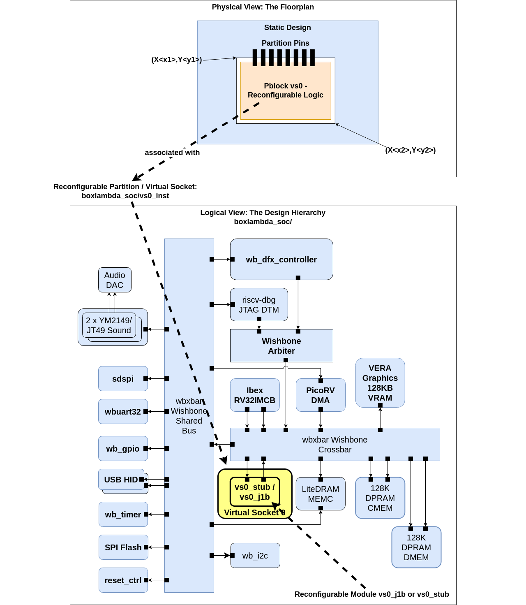
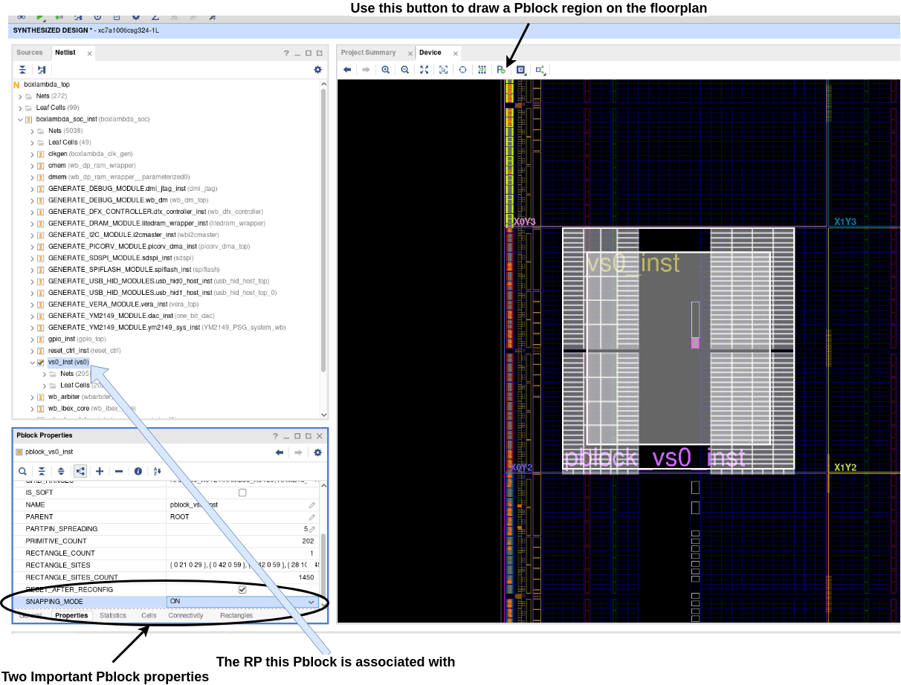
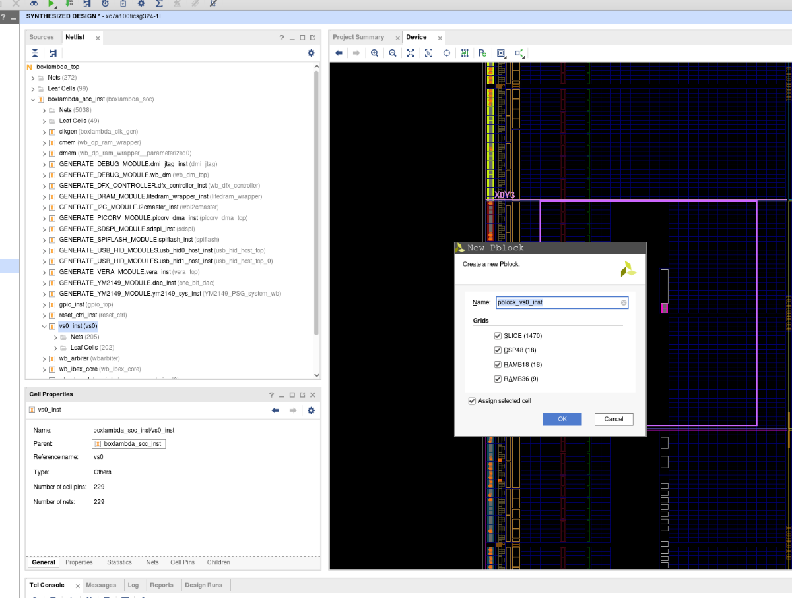
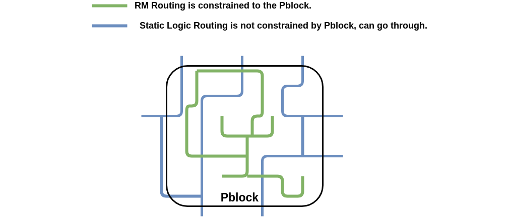

## The BoxLambda DFX Project Build

**BoxLambda DFX Project in the BoxLambda Directory Tree**:  
[boxlambda/gw/projects/boxlambda-dfx](https://github.com/epsilon537/boxlambda/tree/master/gw/projects/boxlambda_dfx)

This project builds the 'official' BoxLambda DFX Configuration as described in the [Architecture section](architecture.md#the-dfx-configuration).



*DFX Terminology applied to the BoxLambda SoC.*

### The Goal: Dynamically Loading Application-Specific Gateware-Assists

The goal of adding DFX support to BoxLambda is to enable BoxLambda software applications to dynamically load an application-specific gateware component into the SoC's *Virtual Socket 0 (VS0)* placeholder component. This component acts as a gateware-assist for the software application.

In the BoxLambda SoC, instance *boxlambda_soc_inst/vs0_inst* is set up as a Reconfigurable Partition (RP). To demonstrate DFX, two Reconfigurable Modules (RMs) fitting this RP are created: *vs0_j1b* and *vs0_stub*. More details on these components can be found on the [VS0 page](components_vs0.md).

### Building and Running BoxLambda DFX

See [DFX Test](test-build-dfx.md).

### Adding a Reconfigurable Partition (RP)

Currently, the BoxLambda SoC has only one RP, VS0, but additional RPs can be created. Here’s how to add a new RP, named VS1.

#### Step 1: Reparameterize the DFX Controller to Manage a Second RP

Refer to the section on [DFX Controller Parameterization](components_dfx_controller.md#dfx-controller-parameterization).

#### Step 2: Synthesize the SoC with an Empty RP

To begin, synthesize the project (the Static Design) with an empty declaration for the *vs1* module:

```verilog
module vs1 (
  ...
);
endmodule
```

- **Directory**: *build/arty-a7-100t/gw/projects/<project_name>*
- **Build Command**: `make <project_name>_synth`

#### Step 3: Synthesize the Default RM

Next, synthesize the component to use as the default module for this RP.

- **Directory**: *build/arty-a7-100t/gw/components/<component>*
- **Build Command**: `make <component_name>_synth`

Note the resource utilization of the component. This will help ensure that the Reconfigurable Partition (RP) is large enough to accommodate the RM.

#### Step 4: Mark the Hierarchical Instance as an RP

Using the Vivado GUI, open the SoC’s static synthesis checkpoint and mark the VS1 instance as an RP by assigning the *HD.RECONFIGURABLE* property and tagging it as a black box:

```tcl
open_project project.xpr
open_run synth_1
set_property HD.RECONFIGURABLE TRUE [get_cells boxlambda_soc_inst/vs1_inst]
update_design -quiet -cell boxlambda_soc_inst/vs1_inst -black_box
```

Keep the Vivado GUI session open. The next steps, up to [Step 6](#step-6-create-a-pblock-for-the-rp), are performed in this session.

#### Step 5: Assign the Default RM to the RP

Load the default component synthesis checkpoint and assign it to the RP *boxlambda_soc_inst/vs1_inst* to make it the default RM.

```tcl
read_checkpoint -cell boxlambda_soc_inst/vs0_inst vs0_stub_synth.dcp
```

#### Step 6: Create a Pblock for the RP

In the Vivado GUI, create a Pblock for RP *VS1* by outlining its region in the design’s floor plan. The procedure for VS1 is the same as for VS0.



*A Pblock on the Floor Plan.*

1. Select *boxlambda_soc_inst/vs1_inst* in the Netlist window to assign the Pblock to this RP.
2. In the floor plan window, click the *Draw Pblock* button.
3. Draw a rectangular region while keeping track of the number of selected resources (e.g., LUTs, BRAM) to ensure enough resources are available for the largest RM.

   

   *When outlining a Pblock, the selected resources are shown.*

4. In the Properties view, check *RESET_AFTER_RECONFIG* and enable *SNAPPING_MODE*. *RESET_AFTER_RECONFIG* ensures the RM is initialized after reconfiguration, and *SNAPPING_MODE* aligns the Pblock region boundaries with the FPGA’s requirements.
5. Run DFX Design Rule Checks: *Reports -> Report DRC* and resolve any errors.
6. Write the Pblock constraints to a file:

    ```bash
    write_xdc ./Sources/xdc/top_all.xdc
    ```

The resulting Pblock constraints might look like this:

```tcl
create_pblock pblock_vs1

add_cells_to_pblock [get_pblocks pblock_vs1] [get_cells -quiet [list boxlambda_soc_inst/vs1_inst]]

resize_pblock [get_pblocks pblock_vs1] -add {SLICE_X6Y100:SLICE_X45Y149}
resize_pblock [get_pblocks pblock_vs1] -add {DSP48_X0Y40:DSP48_X0Y59}
resize_pblock [get_pblocks pblock_vs1] -add {RAMB18_X0Y40:RAMB18_X0Y59}
resize_pblock [get_pblocks pblock_vs1] -add {RAMB36_X0Y20:RAMB36_X0Y29}

set_property RESET_AFTER_RECONFIG true [get_pblocks pblock_vs1]

set_property SNAPPING_MODE ON [get_pblocks pblock_vs1]
```

The placement of the Pblock in the floor plan can significantly impact routing. It may take some experimentation to determine which placements are routable and meet timing.

One guideline is to first implement the design with the largest candidate RM statically instantiated (i.e., without using DFX), then examine the Vivado router's placement of the module to inform the Pblock placement.

Add the Pblock constraints from the previous step to the project's DFX constraints file, specified in the project build's Bender.yml file. For the BoxLambda DFX project, the constraints file is:

[gw/projects/boxlambda_dfx/constrs/pblocks.xdc](https://github.com/epsilon537/boxlambda/blob/master/gw/projects/boxlambda_dfx/constrs/pblocks.xdc)

#### Step 8: Update the Project Build CMakeLists.txt

In the *gw_project_rules_dfx_vivado()* call of the project build’s CMakeLists.txt file:

1. Add the RP instance *boxlambda_soc_inst/vs1_inst* to the VS_INSTS list.
2. Add the default RM for this RP to the VS_DEFAULT_COMPONENTS list.

The result might look like this:

```tcl
gw_project_rules_dfx_vivado(
  TOP_MODULE boxlambda_top
  PROJECT_NAME boxlambda_dfx
  # Location of the virtual socket in the design:
  VS_INSTS
    boxlambda_soc_inst/GENERATE_VS0_MODULE.vs0_inst
    boxlambda_soc_inst/GENERATE_VS1_MODULE.vs1_inst
  VS_DEFAULT_COMPONENTS
    vs0_stub
    vs1_default
)
```

Here, *vs1_default* is the default RM for VS1. More details on creating RMs are available [here](components_vs0.md#creating-a-new-vs0-rm-dfx).

#### Step 9: Route the Design and Generate the Bitstreams

- **Directory**: *build/arty-a7-100t/gw/projects/<project_name>*
- **Build Command**: `make <project_name>_bit`

This step generates multiple bitstream files:

- *<project_name>.bin*: A full bitstream of the SoC, with the default RMs instantiated in the RPs.
- *<project_name>_pblock_vs<x>_partial.bin*: A partial bitstream of just the default RM for VS<x>. A partial bitstream file is generated for each RP.

### Caveat: Re-implement RMs if the Static Design Changes



*Pblock selective routing constraints.*

It was initially assumed that if, in addition to creating a Pblock, the RP’s Partition Pins are constrained to a specific location, RMs and Static Design could evolve independently, as long as they fit within those constraints. However, this is not the case.

A Pblock constrains the RM’s routing within the Pblock boundaries but does not constrain the Static Design’s routing outside the Pblock. As a result, changes to the Static Design’s routing (both inside and outside the Pblock) require the RMs to be re-implemented to accommodate the updated Static Design routing.


For more details, refer to this Xilinx-AMD support article: [https://adaptivesupport.amd.com/s/article/61284?language=en_US](https://adaptivesupport.amd.com/s/article/61284?language=en_US).

