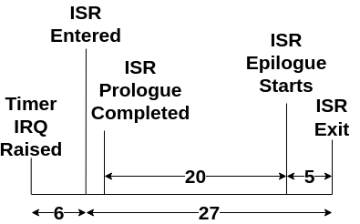

# Interrupt Handling

## Vectored Mode

Ibex handles interrupts in *Vectored Mode*. Each interrupt has a separate entry point in a vector table. When an interrupt occurs, the CPU jumps to the address calculated by multiplying the `IRQ_ID` by four and adding it to the vector table base address. The vector table base address is specified in the `mtvec` CSR. In BoxLambda, after reset, the vector will initially point at `0x1150000`. Crt0's `_start()` function will set it to 0 (in IMEM), so from then on an interrupt's entry point address is `IRQ_ID*4`.

## Vectors.S Weak Bindings

The interrupt entry points are all defined in the bootstrap component's [vector.S](../../../../../sw/components/bootstrap/vectors.S) module. Each entry point is 4 bytes wide, so there's just enough space for an instruction to jump to the actual interrupt service routine of the interrupt in question. This creates a small problem: if you insert a straightforward call to your application-specific interrupt service routine into the vector table, you introduce an inverted dependency. You don’t want the lowest-level platform code to depend directly on higher-level application code. To get around that issue, I defined *weak bindings* for all the interrupt service routines inside `vectors.S`:

```
// Weak bindings for the fast IRQs. These will be overridden in the
// application code requiring interrupt handling for a given source.
.globl _icap_irq_handler
.weak _icap_irq_handler
_icap_irq_handler:
.globl _dfx_irq_handler
.weak _dfx_irq_handler
_dfx_irq_handler:
.globl _uart_irq_handler
.weak _uart_irq_handler
_uart_irq_handler:
.globl _i2c_irq_handler
.weak _i2c_irq_handler
_i2c_irq_handler:
.globl _usb_hid_0_irq_handler
.weak _usb_hid_0_irq_handler
_usb_hid_0_irq_handler:
.globl _usb_hid_1_irq_handler
.weak _usb_hid_1_irq_handler
_usb_hid_1_irq_handler:
.globl _gpio_irq_handler
.weak _gpio_irq_handler
_gpio_irq_handler:
.globl _sdspi_irq_handler
.weak _sdspi_irq_handler
_sdspi_irq_handler:
.globl _dmac_irq_handler
.weak _dmac_irq_handler
_dmac_irq_handler:
.globl _rm_0_irq_handler
.weak _rm_0_irq_handler
_rm_0_irq_handler:
.globl _rm_1_irq_handler
.weak _rm_1_irq_handler
_rm_1_irq_handler:
.globl _rm_2_irq_handler
.weak _rm_2_irq_handler
_rm_2_irq_handler:
.globl _timer_irq_handler
.weak _timer_irq_handler
_timer_irq_handler:
  jal x0, _exc_handler //If the IRQ handler does not get overridden and the IRQ fires, jump to the exception handler.
.weak _exc_handler
_exc_handler:          //_exc_handler is overridden in the interrupt SW module.
  jal x0, _exc_handler
```

As you can see, the weak bindings jump to `_exc_handler`, and the default `_exc_handler` jumps to itself. The idea is that these default weak bindings are never invoked and are instead replaced by actual interrupt service routine implementations in higher-layer code. On the BoxLambda OS build, the Forth Core will take ownership of all the IRQ vectors. See [interrupts.s](../../../../../sw/components/forth/interrupts.s). In gateware test builds, test C code may bind some or all of the IRQs. See [Ibex RISC-V Interrupt Handling in Test C Components](../../../base-platform/c-components/test/irqs.md).

## The IRQ Shadow Registers

The CPU switches to an [interrupt register bank](../../../../soc/components/ibex.md#interrupt-shadow-registers) when entering interrupt mode. This means that the ISR doesn't need to save and restore the registers it uses. The regular ISR prologue and epilogue code (saving and restoring registers) can be skipped. Such an ISR is called a *naked* ISR.

The interrupt shadow register feature, combined with naked ISRs, results in very low interrupt overhead. For a timer interrupt, for example, the ISR timing looks like this:

[](../../../../assets/irq-overhead-after.png)

*Interrupt Overhead with interrupt shadow registers and naked ISR.*

## Nested Interrupts

Nested interrupts are not supported.

