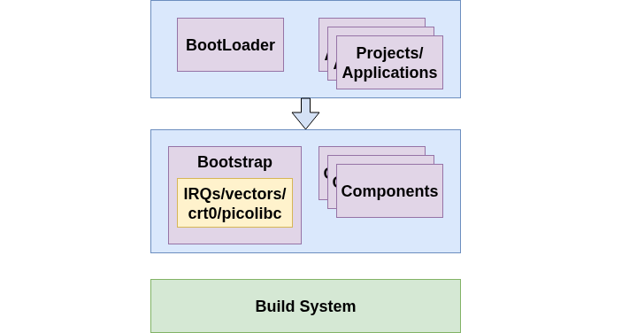

# The Base Platform Architecture

*BoxLambda Base Platform Architecture.*

The BoxLambda Base Platform consists of:

- a collection of reusable target software components, including:

    - HAL/driver-level components interacting with specific features of the BoxLambda SoC (USB HID, SDSPI driver, ...).
    - Higher level software components such as FATFS, ST-Sound player...

- a bootstrap component creating a target C environment and hooking up interrupt handlers.
- a build system allowing the user to easily add components and **applications** using those components.

    - The **Bootloader** is one such application.
    - The main application is the [BoxLambda OS](../applications/boxlambda-os/architecture.md).
    - Other applications include test programs supporting test gateware builds such as the [DDR test](../../soc/test/builds/ddr.md), [USB-HID test](../../soc/test/builds/usb-hid.md).

