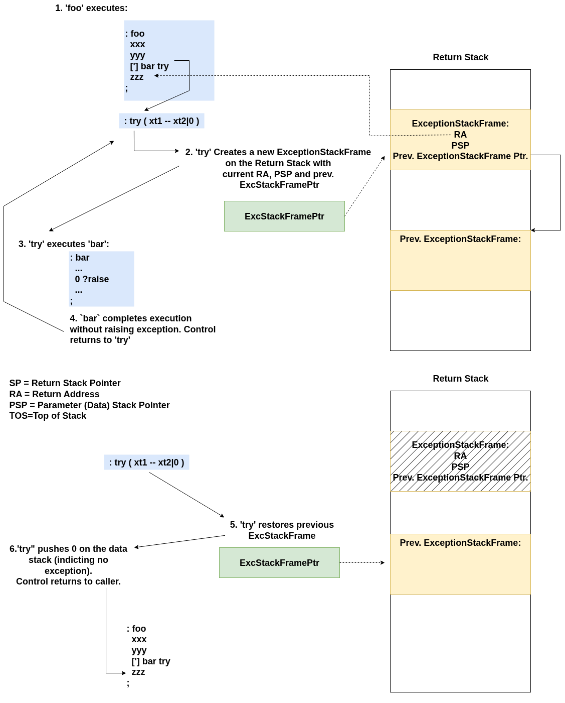
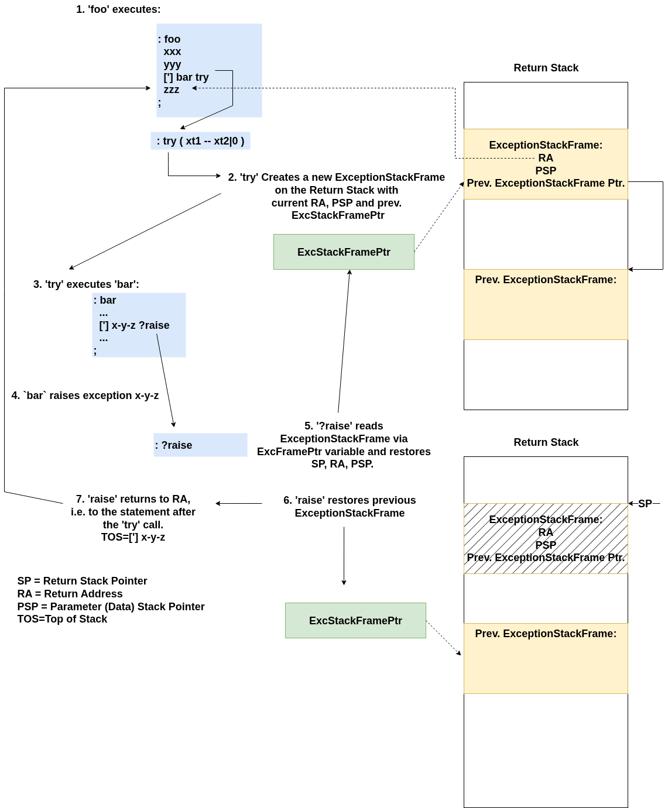

# Forth Exception Handling

The following diagram illustrates Word `foo` successfully *trying* `bar`, i.e. bar does not raise an exception.

[](../../../assets/foo-tries-bar-no-exception.png)

*Foo Successfully tries bar.*

In the next diagram, `foo` again *tries* `bar`, but this time, `bar` raises an exception called `x-y-z`:

[](../../../assets/foo-tries-bar-throws-exception.png)

*Foo tries bar, with exception.*

Raising an exception *outside* of a try block results *restoring* the state to whatever the `ExcStackFramePtr` variable points to.
To avoid unexpected behavior, the top-level REPL (i.e. the quit loop) is placed within a try-block.

## Caveat

A caveat to keep in mind: A raised exception returns the Data Stack to its state before the try call.
Consequently, code within a try-block that might throw an exception should not manipulate data stack items *outside* of the try-block.

For example:

```
: x-y-z ." x-y-z exception raised." cr;

: double-it ( n -- n')
  2*
  ['] x-y-z ?raise
;

: foo ( -- n )
    3
    [: dup double-it ;] try ( n exception-xt )
    drop ( n )
;

: bar ( -- n )
    3 dup
    [: double-it ;] try ( n exception-xt )
    drop ( n )
;

foo . cr
bar . cr
```

`Foo . cr` will print the value 3. However, `bar . cr` will print the value 6 because in bar's case, `double-it` reaches outside of the data stack frame restored by `?raise`.

