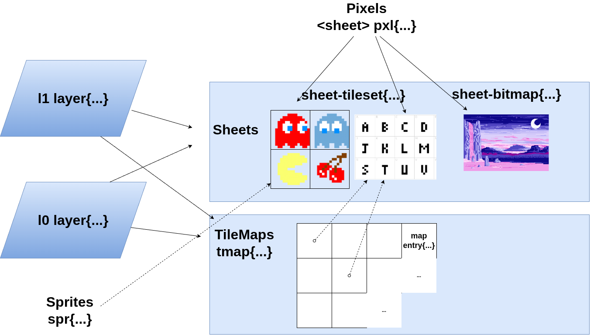
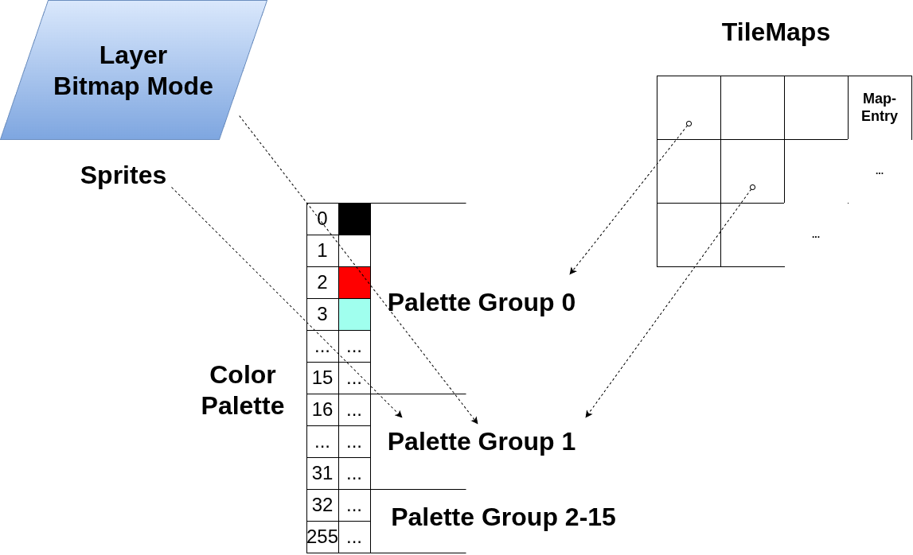
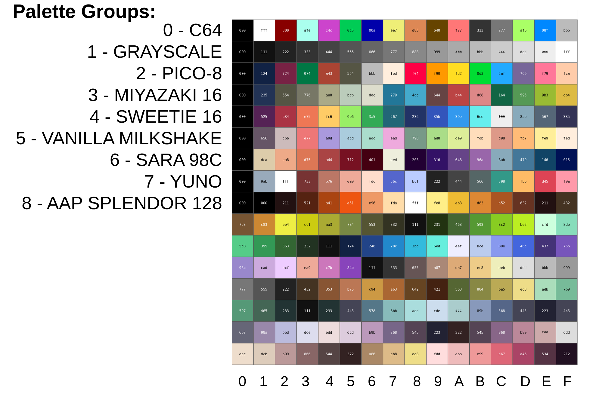
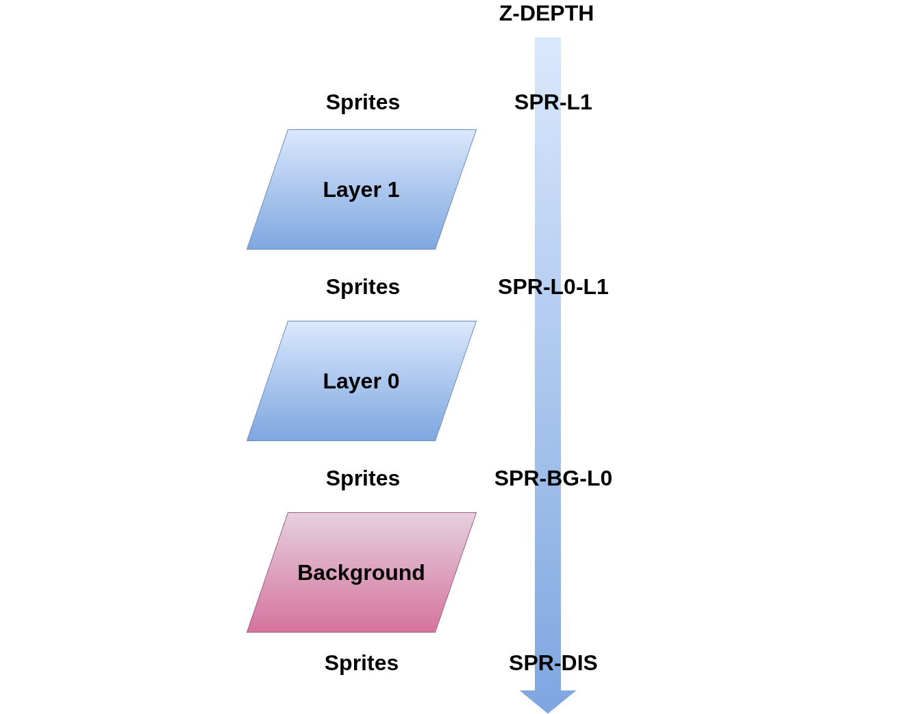

# VERA Graphics

## Concepts

The VERA Forth Module is designed around the following concepts:

- **Sheets**: Sheets hold pixel data in VRAM. There are two types of sheets:
    - **Tilesets**: The sheet is subdivided into a number of tiles, e.g. a font or a sprite sheet. Tilesets are configured using the `sheet-tileset{}` API.
    - **Bitmaps**: The sheet is a screen wide bitmap. Bitmaps are configured using the `sheet-bitmap` API.
- **Pixels**: The pixel API, `pxl{}`, is used to set or get pixels in a sheet.
- **Tilemaps** and **MapEntries**: A Tilemap divides the screen into a grid of *MapEntries*. Each MapEntry in this grid references a specific tile in a tileset (e.g. by its ASCII character code). Tilemaps are configured with the `tmap{}` API. MapEntries are accessed using the `mapentry{}` API.
- **Sprites**: Moveable objects. Sprites are associated with tiles in a tilesheet for their pixel data. Sprites are manipulated with the `spr{}` API.
- **Layers**: VERA has two layers `l1` and `l0`. Each layer can be configured in *tilemap mode* or *bitmap mode*. When in tilemap mode, the layer is associated with a tilemap and tileset sheet. When in bitmap mode, the layer is associated with a bitmap sheet. Layers are configured using the `layer{}` API.

[](../../../assets/vera-module-concepts.png)

*VERA Module Concepts.*

## Palette Groups

VERA divides the 256 color palette is into 16 Palette Groups of 16 colors each.
Pixels have a color index of either 0-3 (2bpp), 0-15 (4bpp), 0-255 (8bpp). This color index is processed using the following logic:

  - Color indices 0 (transparent) and 16-255 are palette-absolute.
  - Color indices 1-15 are relative to the selected palette group.

The palette group to use is specified as a [mapentry](), [sprite]() or [bitmap sheet]() attribute.

[](../../../assets/vera-pal-group-refs.drawio.png)

*Palette Groups referenced from sprites, mapentries and bitmap mode layers.*

This is the default palette:

[](../../../assets/default-palette.png)

*The Default Palette (click to zoom).*

## Z-Depth and Transparency

Pixels set to color index 0 are transparent.

If both layers are enabled, Layer 1 sits in front of Layer 0. Sprites can be positioned in front of or behind a given layer using their *z-depth* attribute, as illustrated in the following diagram:

[](../../../assets/vera-z-depth.png)

*Z-Depth.*

- `SPR-L1`: position the sprite in front of Layer 1.
- `SPR-L0-L1`: position the sprite between Layer 0 and Layer 1.
- `SPR-BG-L0`: position the sprite between the background Layer 0.
- `SPR-DIS`: position the sprite behind the background, i.e. disable the sprite.

## Parameter Blocks

The VERA module API relies heavily on *Parameter Blocks* to configure the attributes of objects. Here's an example:

```
<sheet-tileset> ts
ts sheet{ 8 width 8 height 1 bpp 256 tiles }apply
```

Here `ts` is a tileset sheet object and `sheet{...}apply` is the parameter block used to configure the tileset sheet.
The attributes within a parameter block can be specified in any order. The following two lines are equivalent:

```
ts sheet{ 8 width 8 height 1 bpp 256 tiles }apply
ts sheet{ 256 tiles 8 height 8 width 1 bpp }apply
```

Forth being stack oriented, this statement...

`ts sheet{ 8 width 8 height 1 bpp 256 tiles }apply`

...is equivalent to this statement:

`ts 256 1 8 8 sheet{ width height bpp tiles }apply`

Attributes can also be specified incrementally using `}set` followed by `}apply`:

```
ts sheet{ 8 width 8 height }set
ts sheet{ 1bpp }set
ts sheet{ 256 tiles }apply
```

`}set` records the given attributes in the object, `}apply` commits them to VERA hardware.

## Exceptions

`vram :: x-alloc-failed`

- VRAM allocation failed.

## Constants

`SCANLINE-VISIBLE-MAX`

- The highest VGA scanline value before wrapping back to 0.
  Note that scanlines between `SCANLINE-MAX` and `SCANLINE-VISIBLE-MAX` will not be visible.

`SCANLINE-MAX`

- The highest visible VGA scaline value.

`HSTOP-MAX`

- The maximum value of HSTOP (horizontal stop), specified in native 640x480 display space.
  HSTART and HSTOP determine the horizontally active part of the screen.

`VSTOP-MAX`

- The maximum value of VSTOP (vertical stop), specified in native 640x480 display space.
  VSTART and VSTOP determine the vertically active part of the screen.

`MAX-TILES-IN-SHEET`

- The maximum number of tiles a sheet can hold.

`#LAYERS`

- The number of rendering layers supported by VERA.

`#SPRITE_BANKS`

- The number of sprite banks supported by VERA.

`#SPRITES_IN_BANK`

- The number of sprites in one sprite bank.

`#SPRITES`

- The number of sprites supported by VERA (across sprite banks).

`MAX_SPRITE_ID`

- The maximum sprite ID value supported by VERA.

`#PAL-GROUPS`

- The number of Palette Groups.

## VRAM

`vram-reset ( -- )`

- Reset VRAM, release all VRAM resources.

`vram-alloc ( size-bytes -- addr )`

- Allocate memory in VRAM for a tilemap, bitmap, tiles, or sprites. The [sheet and tilemap creation/initialization Words]() use this Word to allocate their resources.  
  `size-bytes`: the number of bytes to allocate.  
  If successful, returns a 2KB-aligned Pointer to allocated block of memory in VRAM.  
  If not successful, a vram :: x-alloc-failed exception is raised.

`vram-free ( addr -- )`

- Release VRAM allocated with vram-alloc.

`vram-base ( -- vram-base-addr )`

- Return the VRAM base address.
 
- vram. ( -- )`

- Print VRAM usage.

## Tile Maps

A Tilemap is a grid of tiles. The grid is characterized by width, height and tile type. The grid is populated used the `mapentry{...}` API described in the next subsection.

`<tmap> tmap{ <width> width <height> height <type> type }apply`  
`<tmap> tmap{ <width> width <height> height <type> type }set`

- A tilemap parameter block. The `<...>` items indicated what type of value is expected on the top of the stack at this point, to be consumed by the following Word.
    - `<tmap>`: A tilemap object.
    - `<width>`: The tilemap width: 32, 64, 128 or 256.
    - `<height>`: The tilemap height: 32, 64, 128 or 256.
    - `<type>`: The tilemap type:
        - `TMAP-TXT16`: 16 color foreground 16 color background text mode.
        - `TMAP-TXT256`: 256 color foreground single color background text mode.
        - `TMAP_TILE`: tile mode.

    `}apply ( -- )` ends a tilemap parameter block and (re)allocates VRAM for this tilemap to accommodate the given width and height.
    If VRAM was previously allocated for this tilemap, this VRAM will be released before reallocating VRAM.  
    Throws `vram :: x-alloc-failed` exception if VRAM allocation failed.

    `}set ( -- )` ends a tilemap parameter block and records the given tilemap parameters in the tilemap object, but doesn't apply the parameters yet. Useful when setting parameters piecemeal.

`tmap-params-apply ( tilemap -- )`

- Apply the tilemap parameters previously recorded in a `tmap{...}set` block.  
  If VRAM was previously allocated for this tilemap, this VRAM will be released before reallocating VRAM.  
  Throws `vram :: x-alloc-failed` exception if VRAM allocation failed.

`tmap-width@  ( tilemap -- width )`

- Retruns the tilemap's width. Returns 32, 64, 128 or 256.

`tmap-height@ ( tilemap -- height )`

- Returns the tilemap's height. Returns 32, 64, 128 or 256.

`tmap-type@ ( tilemap -- type )`

- Returns the tilemaps type. Returns `TMAP-TXT16`, `TMAP-TXT256` or `TMAP-TILE`.

`tmap-base@ ( tilemap -- addr )`

- Retrieve tilemap base address in VRAM.

`tmap. ( tilemap -- )`

- Print the tilemap object attributes.

`tmap-deinit ( tilemap -- )`

- Deinitialize the tilemap, freeing VRAM resources.

`<tmap> ( "name" -- )`

- Create and initialize a tilemap object.

## Map Entry

The Mapentry API is used to enter characters/tiles, along with their attributes, in a tilemap grid.

`<tmap> mapentry{ <bg> bg <fg> fg <tidx> tidx <pal-group> pal-group <flip> flip <vec2> xy }apply`  
`<tmap> mapentry{ <bg> bg <fg> fg <tidx> tidx <pal-group> pal-group <flip> flip <vec2> xy }set`  
`<tmap> mapentry{ <vec2> xy }get`

- A mapentry parameter block. The `<...>` items indicated what type of value is expected on
  the top of the stack at this point, to be consumed by the following Word.
  - `<tmap>`: A tilemap object.
  - `<bg>`: Background color palette index. 0..15. Only used in 16 color text mode.
  - `<fg>`: Foreground color palette index.
    - 0..255 in 256 color text mode.
    - 0..15 in 16 color text mode.
    - Not used in tile mode.
  - `<tidx>`: Index of the tile to draw at this mapentry position.
  - `<pal-group>`: Palette group. 0..15. Only used in tile mode. See [Palette Groups](#palette-groups).
  - `<flip>`: Flip tile: `VFLIP`, `HFLIP`, `VFLIP_HFLIP` or 0.
  - `<vec2>`: The column and row position of the mapentry, specified as a vec2 object. See [vec2.fs]().

  `}apply ( -- )` ends a mapentry parameter block and applies the mapentry as specified.

  `}set ( -- )` ends a mapentry parameter block and records the given mapentry parameters in the tilemap object, but doesn't apply the parameters yet. Useful when setting parameters piecemeal.

  `}get ( -- )` ends a mapentry parameter block. Read from VRAM the specified mapentry location
  and decode it, populating fg, bg, pal-group, flip attributes. This is useful for mapentry read-modify-write operations.

`mapentry-params-apply ( tilemap -- )`

- Apply the mapentry parameters previously recorded in a mapentry{...}set block.

`mapentry! ( mapentry vec2 tilemap -- )`

- Set a 16-bit mapentry value at given position tilemap. The position is specified by a vec2 object. See [vec2.fs]().

`mapentry@ ( vec2 tilemap -- mapentry )`

- Read the 16-bit mapentry value from position in given tilemap. The position is specified by a vec2 object [vec2.fs]().

`unpack-txt16 ( mapentry -- tidx fg bg )`

- Unpack tidx, fg and bg color from a 16 color textmode map entry value.

`unpack-txt256 ( mapentry -- tidx fg )`

- Unpack tidx and fg color from a 256 color textmode map entry value.

`unpack-tile ( mapentry -- tile-idx flip pal-group )`

- Unpack tile, flip and palette group from a 2/4/8bpp tile map entry value. The color index of tile pixels is processed using the following logic:
  - Color indices 0 (transparent) and 16-255 are palette absolute.
  - Color indices 1-15 are relative to the palette group.

## Sheets

A *Sheet* object can hold a *Tileset* (e.g. a font or sprite sheet) or a single *Bitmap* (a display-wide image).

`<tileset> sheet{ <width> width <height> height <bpp> bpp <#tiles> tiles }apply`
`<tileset> sheet{ <width> width <height> height <bpp> bpp <#tiles> tiles }set`
`<bitmap> sheet{ <width> width <height> height <bpp> bpp }apply`
`<bitmap> sheet{ <width> width <height> height <bpp> bpp }set`

- A sheet parameter block. The `<...>` items indicated what type of value is expected on
  the top of the stack at this point, to be consumed by the following Word.
  - `<tileset>`: A tileset sheet object.
  - `<bitmap>`: A bitmap sheet object.
  - `<width>`: The tile width:
    - 8 or 16 for regular tiles.
    - 8, 16, 32 or 64 for sprites.
    - 320 or 640 for bitmaps.
  - `<height>`: The tile height:
    - 8 or 16 for regular tiles.
    - 8, 16, 32 or 64 for sprites.
    - 1..4095 for bitmaps.
  - `<bpp>`: Bits per pixel:
    - 1, 2, 4 or 8 for regular tiles and bitmaps.
    - 4 or 8 for sprites.
  - `<#tiles>`: The number of tiles in the tileset. 0..1023. Not used in case of bitmaps.

  `}apply ( -- )` ends a sheet parameter block and (re)allocates VRAM for this sheet to accommodate #tiles, bpp, width and height.
  If VRAM was previously allocated for this sheet, this VRAM will be released before reallocating VRAM.
  Throws vram :: x-alloc-failed exception if VRAM allocation failed.

  `}set ( -- )` ends a sheet parameter block and records the given sheet parameters in the sheet object, but doesn't apply the parameters yet. Useful when setting parameters piecemeal.

`sheet-params-apply ( sheet -- )`

- Apply the sheet parameters previously recorded in a `sheet{...}set` block.

`sheet-addr>tidx ( addr tileset -- tile-idx )`

- Given a VRAM address and a sheet, compute the tile index corresponding to that address. Tileset sheets only.

`sheet-tidx>addr ( tile-idx tileset -- addr )`

- Given a tile index in a sheet, compute the address (in VRAM) of the pixel data of that tile. Tileset sheets only.
  tile_idx: Index of the tile in the sheet. Range 0..num_tiles-1.
  sheet: Sheet object.

`sheet-tilesize@ ( tileset -- tilesize-bytes )`

- Returns the size in bytes of one tile in the given tileset. Tileset sheets only.

`sheet-size@ ( sheet -- sheetsize-bytes )`

- Returns the sheet size in bytes.

`sheet-width@ ( sheet -- width )`

- Returns the sheet width.

`sheet-height@  ( sheet -- height )`

- Returns the sheet height.

`sheet-bpp@ ( sheet -- bpp )`

- Returns the sheet's bits-per-pixel.

`sheet-#tiles@  ( sheet -- #tiles )`

- Returns the number of tiles in the sheet. Always returns 1 in case of a bitmap sheet.

`sheet-base@  ( sheet -- addr )`

- Retrieve sheet base address in VRAM.

`sheet-type@ ( sheet -- type )`

- Returns the sheet type: `SHEET-BITMAP` or `SHEET-TILESET`.

`sheet. ( sheet -- )`

- Print the sheet attributes.

`sheet-deinit ( sheet -- )`

- Deinitialize the sheet, freeing VRAM resources.

`<sheet-bitmap> ( "name" -- )`

- Create and initialize a bitmap sheet object.

`<sheet-tileset> ( "name" -- )`

- Create and initialize a tileset sheet object.

## Pixels

`<tileset> pxl{ <tidx> tidx <color> color <vec2> xy }apply`
`<tileset> pxl{ <tidx> tidx <color> color <vec2> xy }set`
`<tileset> pxl{ <tidx> tidx <vec2> xy }get`
`<bitmap> pxl{ <color> color <vec2> xy }apply`
`<bitmap> pxl{ <color> color <vec2> xy }set`
`<bitmap> pxl{ <vec2> xy }get`

- A pixel parameter block. The <...> items indicated what type of value is expected on
  the top of the stack at this point, to be consumed by the following Word.
  - `<tileset>`: A tileset sheet object.
  - `<bitmap>`: A bitmap sheet object.
  - `<tidx>`: Index of the tile in the tileset sheet. `0..num_tiles-1.`
  - `<color>`: The pixel color palette index.
  - `<vec2>`: The pixel position in the tile, specified as a vec2. See [vec2.fs]().

  `}apply ( -- )` ends a pixel parameter block and draw the pixel in the tile as specified.

  `}set ( -- )` ends a pixel parameter block and records the given pixel parameters in the sheet object, but doesn't apply the parameters yet. Useful when setting parameters piecemeal.

  `}get ( -- color )` ends a pixel parameter block. Returns the pixel color from the given position within the tile or bitmap.

`pxl-params-apply ( sheet -- )`

- Apply the pixel parameters previously recorded in a pxl{...}set block.

## Sprites

`<spr> spr{ <vec2> xy <flip> flip <z> z <colmask> colmask <pal-group> pal-group <tidx> tidx <tileset> sheet }apply`
`<spr> spr{ <vec2> xy <flip> flip <z> z <colmask> colmask <pal-group> pal-group <tidx> tidx <tileset> sheet }set`

- A sprite parameter block. The `<...>` items indicated what type of value is expected on
  the top of the stack at this point, to be consumed by the following Word.
  - `<spr>`: A sprite object
  - `<vec2>`: The sprite position in the tile, specified as a vec2. See [vec2.fs]().
  - `<flip>`: Flip the sprite: `VFLIP`, `HFLIP`, `VFLIP_HFLIP` or 0.
  - `<z>`: The sprite's z-depth:
    `SPR-DIS` : Disable the sprite (or, if you will, position it behind the background).
    `SPR-BG-L0` : Position sprite between background and Layer 0.
    `SPR-L0-L1` : Position sprite between Layer 0 and Layer 1.
    `SPR-L1`: Position sprite in front of layer 1.
  - `<colmask>`: Set the sprite collision mask.
  - `<pal-group>`: The sprite's palette group id. See [Palette Groups]().
  - `<tidx>`: Index of the tile in the sheet containing the sprite's pixel data.
  - `<tileset>`: A tileset sheet object.

  `}apply ( -- )`: Commit the sprite's attributes to hardware, i.e. to the sprite attribute RAM.
  `}set ( -- )`: Store the sprite attributes specified in the spr{...}set block, but don't apply them to hardware yet.

`spr-addr@ ( sprite -- addr )`

- Returns the sprite's VRAM address.

`spr-id@ ( sprite -- id )`

- Retruns the sprite's id.

`spr-xy@  ( sprite -- vec2 )`

- Returns the sprite's current coordinates. Returns a vec2. See [vec2.fs]().

`spr-width@  ( sprite -- width )`

- Returns the sprite's width.

`spr-height@  ( sprite -- height )`

- Returns the sprite's height.

`spr-flip@ ( sprite -- flip )`

- Returns the sprite's flip value: `VFLIP`, `HFLIP`, or `VFLIP_HFLIP`.

`spr-z@ ( sprite -- zdepth )`

- Returns the sprite's z-depth: `SPR-DIS`, `SPR-BG-L0`, `SPR-L0-L1`, `SPR-L1`.

`spr-colmask@ ( sprite -- colmask )`

- Returns the sprite's collision mask.

`spr-pal-group@  ( sprite -- pal-group )`

- Returns the sprite's palette group id. See [Palette Groups]().

`spr-bpp@  ( sprite -- bpp )`

- Returns the sprite's bits-per-pixel value (8 or 4).

`spr-sheet@ ( sprite -- tileset )`

- Returns the tileset sheet used by this sprite.

`spr-tidx@ ( sprite -- tile-idx )`

- Returns the tile index used by this sprite.

`spr. ( sprite -- )`

- Print the sprite's attributes.

`<spr> ( sprite-idx "name" -- )`

- Create and initialize a sprite object. `sprite-idx` must be in range `0..NUM_SPRITES-1`.

`spr-deinit ( sprite -- )`

- Reset the sprite attribute RAM for the given sprite object.

## Layers

`layer-id@ ( layer -- id )`

- Returns the layer object's layer id.

`layer-tilemap-mode ( tmap sheet layer -- )`

- Configure the layer in tilemap mode. tmap and sheet must be specified.
  - `<layer>`: The layer object: `l0` or `l1`.
  - `<tmap>`: Tilemap object.
  - `<tileset>`: Tileset sheet object.

`layer-bitmap-mode ( bitmap layer -- )`

- Configure the layer in bitmap mode.
  - `<layer>`: The layer object: `l0` or `l1`.
  - `<bitmap>`: bitmap sheet object.

`layer-enable ( f layer -- )`

- Enable/disable the layer.

`layer-enabled? ( layer -- f )`

- Returns true if the layer is enabled.

`layer-tmap-base@ ( layer -- addr )`

- Returns the layer's tilemap base address. Assumes tilemap mode.

`layer-tmap-width@ ( layer -- width )`

- Returns the layer's tilemap width. Assumes tilemap mode.

`layer-tmap-height@ ( layer -- height )`

- Returns the layer's tilemap height. Assumes tilemap mode.

`layer-t256c@  ( layer -- f )`

- Returns true if the layer is in T256c mode. Assumes tilemap mode.

`layer-bpp@ ( layer -- bpp )`

- Returns the layer's bits-per-pixel.

`layer-bitmap-mode@ ( layer -- f )`

- Returns true if the layer is in bitmap mode.
 
`layer-pal-group! ( pal-group layer -- )`

- Set the palette group to be used by this layer (bitmap mode).

`layer-pal-group@ ( layer -- pal-group )`

- Returns the layer's palette group id (bitmap mode).

`layer-hscroll! ( hscroll layer -- )`

- Set the layer's horizontal scroll value.

`layer-hscroll@ ( layer -- hscroll )`

- Returns the layer's horizontal scroll value.

`layer-vscroll! ( vscroll layer -- )`

- Set the layer's vertical scroll value.

`layer-vscroll@ ( layer -- vscroll )`

- Returns the layer's vertical scroll value.

`layer-width@ ( layer -- width )`

- Returns the layer's tile or bitmap width.

`layer-tile-height@ ( layer -- height )`

- Returns the layer's tile height. Returns 0 when in bitmap mode.

`layer-base@ ( layer -- addr-id )`

- Returns the layer's VRAM base address.

`layer-sheet@  ( layer -- sheet )`

- Returns sheet object used by this layer.

`layer-tmap@ ( layer -- tilemap )`

- Returns tilemap object used by this layer (tilemap mode).

`layer. ( layer -- )`

- Print the layer attributes.

## Line Capture

`line-capture-enable ( f -- )`

- Enable/disable VGA line capture.

`line-capture-enabled? ( -- f )`

- Returns true if VGA line capture is pending. Returns false if line capture has been completed.

`line-capture-pxl@ ( x -- rgb )`

- Read the RGB value of a pixel on the captured line. x: the pixel's x position. Range: 0..639.
  returns: 12-bit RGB triple.

## Interrupts

`IRQ-VSYNC-MASK`
`IRQ-LINE-MASK`
`IRQ-SPRCOL-MASK`

- Vertical sync interrupt, line interrupt and sprite collision interrupt mask constants.

`irq-disable ( mask -- )`

- Disable IRQs. The passed in mask will be inverted and AND'd with the installed mask.
  - `mask`: bitwise OR of VERA_IRQs to disable.

`irq-enable ( mask -- )`

- Enable IRQs. The passed in mask will be OR'd with the installed mask.
  - `mask`: bitwise OR of VERA_IRQs to enable.

`irq-enabled ( -- mask )`

- Returns a bitmask of enabled VERA_IRQs.

`irq-get ( -- active-mask )`

- Returns a bitmask of active VERA_IRQs.

`irq-ack ( mask -- )`

- Acknowledge IRQs. 
  - `mask`: bitwise OR of VERA_IRQs to acknowledge.

`irqline! ( scanline -- )`

Set the scanline on which to trigger the line IRQ if `VERA_IRQ_LINE` is enabled.
  - `scanline`: scanline number on which the trigger the line IRQ, must be <= `VERA_SCANLINE_MAX`.

`irqline@ ( -- scanline )`

- Returns the line IRQ's scanline value.

`scanline@ ( -- scanline )`

- Returns the current VGA scanline value.

## Color Palette

```
#0 constant PG-C64
#1 constant PG-GREYSCALE
#2 constant PG-PICO-8
#3 constant PG-MIYAZAKI-16
#4 constant PG-SWEETIE-16
#5 constant PG-VANILLA-MILKSHAKE
#6 constant PG-SARA-98C
#7 constant PG-YUNO
#8 constant PG-AAP-SPLENDOR-128
```

- Palette Group IDs.

```
#0 constant BLACK
#1 constant WHITE
#2 constant RED
#3 constant CYAN
#4 constant PURPLE
#5 constant GREEN
#6 constant BLUE
#7 constant YELLOW
#8 constant ORANGE
#9 constant BROWN
#10 constant LIGHT-RED
#11 constant DARK-GREY
#12 constant GREY
#13 constant LIGHT-GREEN
#14 constant LIGHT-BLUE
#15 constant LIGHT-GREY
```

- Palette Group 0 Color Palette Indices. The Commodore 64 Color Palette.

`greyscale ( n -- n' )`

- Palette Group 1 - Linear grey scale.

`pal! ( rgb idx -- )`

- Write an entry into the palette. idx: the palete color index. rgb: the 12-bit RGB triple.

`pal@ ( idx -- rgb )`

- Read the RGB value of a palette entry. idx: the palete color index. Returns the 12-bit RGB triple.

`pal-group>pal-abs ( pal-group-id rel-idx -- abs-idx )`

- Convert given palette group id and relative index (0..15) to its absolute color palette index value (0..255).
 
`pal-abs>pal-group ( abs-idx -- pal-group-id rel-idx )`

- Convert a color palette absolute index (0..255) to the palette group it belongs to and the relative index within this group.

`pal-group! ( rgb0 .. rgb15 pal-group-id -- )`

- Set all 16 rgb colors in the indicated palette group. Note the palette group id on top-of-stack.
 
`pal-group-1! ( rgb pal-group-id idx -- )`

- Set one of the 16 colors in the given palette group.

`pal-group@ ( pal-group-id -- rgb0 .. rgb15 )`

- Retrieve all 16 rgb color from given palette group.

`pal-group-1@ ( pal-group-id idx -- rgb )`

- Retrieve the rgb color value from given relative index (0..15) in given palette group.

`pal-init ( -- )`

- Load the original palette into the shadow-palette and VERA's palette memory. The vera module maintains a shadow palette in memory because the VERA's hardware palette memory is write-only.

`pal-load ( addr -- )`

- Load a palette into VERA palette memory (and the shadow palette). addr points to a block of 256 half-words, each half-word specifying a 12-bit rgb value corresponding to its index.

## Top-Level Definitions

`display-enable ( flag -- )`

- Enable/disable the display.

`display-enabled? ( -- flag )`

- Returns true if the display is enabled.

`sprites-enable ( flag -- )`

- Enable/disable sprite rendering.

`sprites-enabled? ( -- flag )`

- Returns true is sprite rendering is enabled.

`hscale! ( scale-ufix1-7 -- )`

- Set the horizontal scaling value. The passed in value is a unsigned fixed point 1.7 value.

`hscale@ ( -- scale-ufix1-7 )`

- Retrieve the horizontal scaling value (unsigned fixed point 1.7 value).

`vscale! ( scale-ufix1-7 -- )`

- Set the vertical scaling value. The passed in value is a unsigned fixed point 1.7 value.

`vscale@ ( -- scale-ufix1-7 )`

- Retrieve the vertical scaling value (unsigned fixed point 1.7 value).

`bordercolor! ( pal-idx -- )`

- Set the border color palette index.

`bordercolor@ ( -- pal-idx )`

- Retrieve the border color palette index.

`boundaries! ( hstart hstop vstart vstop -- )`

- Set screen boundaries.

`sprite-bank!  ( 1|0 -- )`

- Select the sprite bank to use. 0 or 1.

`sprite-bank@ ( -- 1|0 )`

- Get the selected sprite bank.

`sprite-reset ( -- )`

- Reset the sprite attribute RAM and reset sprite bank to 0.

`vera-init ( -- )`

- Initialize the Vera subsystem. Performs a VRAM, palette and sprite reset.

