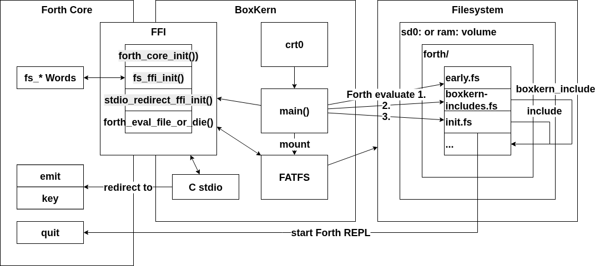

# BoxLambda OS Top-Level

**BoxLambda OS Software Project top-level in the BoxLambda Directory Tree**: [sw/projects/boxlambda_os](../../../sw/projects/boxlambda_os/main.cpp)

## Boot Sequence

After the Bootloader has transferred control to the OS image it has loaded into EMEM, the OS start-up code goes through the following sequence:

1. `crt0.c` sets up a basic C environment as described in the [early software startup sequence](../base-platform/bootstrap/bootstrap.md#early-software-startup-sequence).
2. `main()` goes through the following steps:
    1. Initialize Forth by calling `forth_core_init()`.
    2. Find and mount a filesystem boot volume:
        1. Attempt to mount the SD card volume `sd0:` and the RAM disk volume `ram:`.
        2. Look for a `ram:/forth/` directory. If found, `ram:` becomes the Forth boot volume.
        3. If `ram:/forth/` is not found, look for a `sd0:/forth` directory. If found, `sd0:` becomes the Forth boot volume.
        4. If neither `ram:/forth` or `sd0:/forth` are found, `main()` prompts the user to insert an SD card or to upload a RAM disk containing the target filesystem.
    3. Evaluate Forth module [fs/forth/early.fs](../../../fs/forth/early.fs). This module contains some early definitions extending the core Word set. Currently, only the Word `c-fun` is defined here.
    4. Redirect the C library's stdio to Forth's `emit` and `key` Words. See [stdio_redirect.cpp](../../../sw/components/forth/stdio_redirect_ffi.cpp).
    5. Initialize the Forth<->C Filesystem Foreign Function Interface (FFI). See [fs_ffi.cpp](../../../sw/components/forth/fs_ffi.cpp).
    6. Evaluate the Forth modules listed in [fs/forth/boxkern-includes.fs](../../../fs/forth/boxkern-includes.fs).
    7. Transfer control to Forth by evaluating [fs/forth/init.fs](../../../fs/forth/init.fs). `init.fs` is expected to invoke the `quit` Word, starting the Forth REPL.

*The BoxLambda OS Boot Sequence.*

## The BoxKern-Includes Mechanism

[fs/forth/boxkern-includes.fs](../../../fs/forth/boxkern-includes.fs) may look like a Forth module but it not is a Forth module.

The syntax is limited to lines starting with `\`, which are ignored, and lines starting with the word `boxkern_include` followed by the full
path of a `.fs` Forth module to be evaluated. That Forth module must not include any submodules itself.

The BoxKern loads and passes `boxkern_include` files to the Forth environment at boot time using [Forth-C FFI function](forth/c-ffi.md)  `forth_eval_boxkern_includes_or_die()`. This mechanism allows a limited form of Forth module loading until the Forth `include` Word can be defined. The order of the modules listed in `boxkern-includes.fs` is important because new Words build upon previously defined Words. The modules in `boxkern-includes.fs` build up a stack, with [shell.fs](../../../fs/forth/shell.fs) on top.

