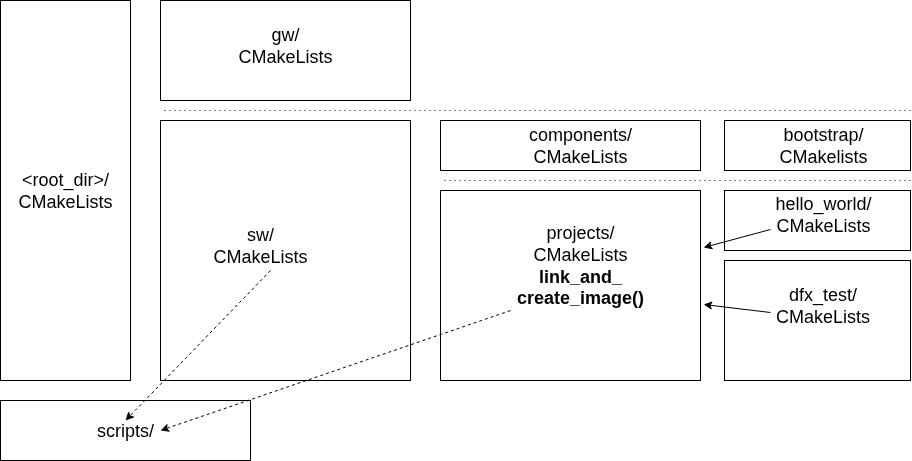

# The Software Build System

## Four Layers

The software build system is organized into four layers:

1. **The Software Project Layer**:
   Example: *Hello World*. This layer represents the top level of the build system. The software ELF executables and flash binaries are built at this level. Depending on what functionality the software project build requires, it will add libraries from the *Software Component Layer*.

2. **The Software Component Layer**:
   Software Components are the building blocks of a software project build. Each component is built as a library and may have dependencies on additional software components in the *Software Component Layer*. The Software Component's sources are located directly in the Software Component's directory, or referenced from specific locations in the submodule layer.

3. **The Submodule Layer**:
   Submodules are Git submodules containing, among other things, source code referenced from the *Software Component Layer*. The software build system does not directly build at this level. Makefiles located in the *Submodule Layer* are not executed.

4. **The Code Generation Layer**:
   Some components require some form of transformation to be turned into source code. The component in question provides specific code generation instructions in the form of a *custom command* (`add_custom_command`) in its `CMakefile.txt`. The custom command is added as a dependency to the generic `cgen` target, which gets executed as part of `make regen`, the build tree (re-)generation command. Except for the [Register Access Layer](../../software/c-components/register-access-layer.md), code-generated files are written to the `codegen/` subdirectory in the build tree.

The following software components currently rely on code generation:

   - **sdram**: Register macros and initialization code for the LiteDRAM module are generated from the LiteX submodule.
   - **Register Access Layer**: This layer, code-generated by Corsair, is part of the source tree, in the [registers/generated](../../../registers/generated) directory.

## The Software CMakeLists

The build system consists of a tree of `CMakeLists.txt` files. The top-level `CMakeLists.txt` adds the `gw/` and `sw/` subdirectories. The `CMakeLists.txt` file in the `sw/` directory adds the `components/` and `projects/` subdirectories, etc., down to the individual SW component and project directories.

### A Software Component CMakeList

The Software Component CMakeList is straightforward: You give the library a name, specify its sources, include paths, and C/CPPFLAGS:

```
add_library(gpio)

target_sources(gpio
    PRIVATE
    gpio.cpp
)

target_compile_options(gpio
 PRIVATE
  -O2 -g -ffunction-sections
)

#Paths to include files users of usb_hid are expected to use.
target_include_directories(gpio
    PUBLIC
        ${CMAKE_CURRENT_LIST_DIR}
        ${PROJECT_SOURCE_DIR}/registers/generated/
)
```

### A Software Project CMakeList

CMake is designed to build software. The necessary functions for creating libraries, executables, etc., are predefined. The only custom function added to the software CMakeLists tree is `link_and_create_image()`. This function executes the necessary steps to link the given target using a given linker script and generate an executable and a memory file. The memory file can be used by the GW part of the build system to initialize IMEM.

A typical SW project `CMakeLists.txt` file looks like this:

```
add_executable(hello_world
 EXCLUDE_FROM_ALL
    hello.cpp
)

#Setting the -g flag for the hello_dbg build testing GDB access.
target_compile_options(hello_world
 PRIVATE -g)

if(CMAKE_BUILD_TYPE STREQUAL "sim")
  link_and_create_image(hello_world
  ${PROJECT_SOURCE_DIR}/sw/components/bootstrap/link_imem_boot.ld)
else()
  link_and_create_image(hello_world
  ${PROJECT_SOURCE_DIR}/sw/components/bootstrap/link_ddr_to_imem_boot.ld)
endif()

target_link_libraries(hello_world gpio riscv bootstrap)

add_flash_sw_target(hello_world)
```

Note that depending on whether we're building for simulation or FPGA, two variants of the linker script are used. See [the Linker Script](../bootstrap/linker-script.md) for more details.

## Software CMakeList Organization



*Software CMakeLists Organization.*

## The Cross-Compiler

The RISCV cross-compiler is a custom-built **riscv32-boxlambda-elf** toolchain. The compiler build is created using the excellent [Crosstool-ng](https://crosstool-ng.github.io/) project. *Crosstool-ng* uses a menuconfig similar to the Linux kernel menuconfig. You just focus on the specifics of the toolchain you want to build (RISC-V, 32-bit, Static Toolchain...). The tool selects good defaults for all the rest.

I selected:

- Target Architecture: *riscv*
- Architecture level: *rv32im_zicsr_za_zb_zbs*
- ABI: *ilp32*
- *Build Static Toolchain*
- Tuple's vendor string: *boxlambda*
- Target OS: *bare-metal*
- Additional support languages: *C++*

The resulting crosstool-ng config file can be found [here](../../../scripts/crosstool-ng.config).

The toolchain tarball is checked into the BoxLambda repo under [../../assets/](../../../assets). The [boxlambda_setup.sh](../../../boxlambda_setup.sh) script unpacks the toolchain tarball in the `tools/` directory, so the user no longer needs to provide the toolchain as a prerequisite.

### RISC-V GCC Compile Flags

The following compile flags are used:

- `march=rv32im_zba_zbb_zbs_zicsr`:
    - `rv32`: 32-bit RISC-V base architecture.
    - `i`: Base integer instruction set (mandatory).
    - `m`: Integer multiplication and division extension.
    - `zba`: Bit-Manipulation instructions for address generation.
    - `zbb`: Bit-Manipulation Base sub-extension.
    - `zbs`: Single-bit instructions.
    - `zicsr`: Control and Status Register (csr) instructions.

- `-mabi=ilp32`:
    - `i`: Integer-based ABI (does not use floating-point registers for function arguments/returns).
    - `l`: Long and int types are 32-bit.
    - `p`: Pointers are 32-bit wide.
    - `32`: Indicates a 32-bit ABI (used for RV32 architectures).

- `Wl,--no-warn-rwx-segments`: Avoid linker warning because executable segments are writable. This is intentional on BoxLambda.

### Toolchain.cmake

RISC-V cross-compilation for C and C++ is set up by passing in a *Toolchain File* to CMake. The toolchain file specifies the names of the compiler executables and the compile flags. The file is located in [scripts/toolchain.cmake](../../../scripts/toolchain.cmake).

