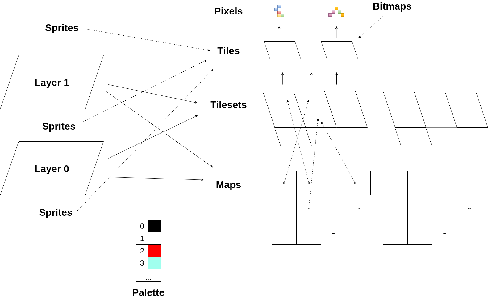
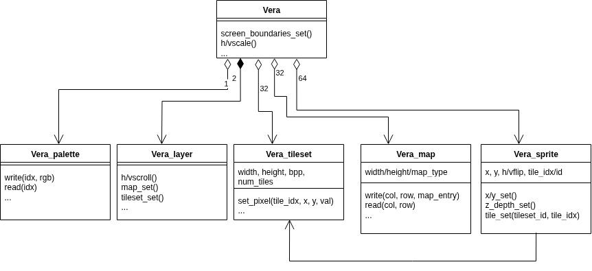

# The VERA HAL

- **Included in OS**: No

- **Exported to Forth**: No

## The VERA API Concepts

*The VERA API Concepts.*

- Pixels reference, by index, colors in a configurable 256-color palette. In 8
bpp mode, the entire palette can be referenced. In 4 bpp or 1 bpp mode, only a
subset of the palette can be selected.
- Tiles contain pixels in a grid. Tiles can be as small as 8x8 pixels, or as large as a
640x480 bitmap.
- Tilesets are groups of tiles with shared properties: tile width, tile height,
  and bits-per-pixel (bpp).
- Maps organize the screen (or rather, a screen layer) into a grid. The grid
elements / map entries reference, by index, tiles belonging to a single tileset.
This map mechanism can be used to set up a text mode grid consisting of 8x8 1bpp tiles
(the font). It can also be used to present a grid of 16x16 8 bpp color tiles in a
side-scrolling shooter.
- VERA has two layers, layer 1 sitting in front of layer 0. Each layer can be
configured into map/tileset mode or into bitmap mode. In bitmap mode, the layer
references a single, bitmap-sized tile. Background colored pixels are
transparent.
- VERA has two banks of 64 sprites. Sprites get their pixel data from tiles of up
to 64x64 pixels. In addition to a x- and y- position, sprites have a
*z-depth* attribute which puts the sprite in front of, between, or behind the two layers.

## The C++ VERA HAL

**VERA HAL**: [sw/components/vera/vera_hal.h](../../../sw/components/vera/vera_hal.h)

The VERA Hardware Abstraction Layer is a C++ class hierarchy:

*VERA Hardware Abstraction Layer (HAL).*

The following classes are defined:

- `Vera_hal`: This is the top-level object. Screen-global settings such as screen
boundaries, scaling, and border color are configured at this level. `Vera_hal` is also the access point to the other objects in the hierarchy.
- `Vera_layer`: Vera has two layers (not counting the sprite 'layer'). The
`Vera_layer` class handles layer-specific settings such as the tileset and map to use, horizontal and vertical scroll offset, etc.
- `Vera_tileset`: This class represents the pixel data of a collection of *tiles* in the most general sense. Tiles can be an 8x8 font in 1 bpp text mode, 16x16 multicolor tiles for use in a game tile map, 32x32 sprites, or even complete 640x480 bitmaps. Vera_tilesets allocate space in VRAM to hold the pixel data for the specified number of tiles.
- `Vera_map`: This class represents a map, or grid, in tile or text mode. The
grid elements are addressed by column and row.
- `Vera_sprite`: This class holds all attributes of 1 sprite, including a
reference to a tile (member of a tileset) containing the sprite's pixel data.
- `Vera_palette`: The 256 RGB palette colors can be set, retrieved, and restored here.

Note:

- There is no `Vera_tile` class. Tiles in a tileset share most of their
properties (width/height/bpp). What isn't shared, a pointer to the tile pixel
data in VRAM, can easily be computed from the index of the tile in the tileset.
In this design, tiles are represented by a `(tileset_id, tile_idx)` tuple, where
`tileset_id` refers to one of the 32 tileset objects, and `tile_idx` the index
of the tile within that tileset.
- There is no `Vera_bitmap` class. Bitmaps are represented by the
`Vera_tileset` class by configuring a width of 320 or 640 pixels. A Vera layer is put
into bitmap mode by calling Vera_layer::bitmap_set() and passing in the tile
object representing the bitmap.

