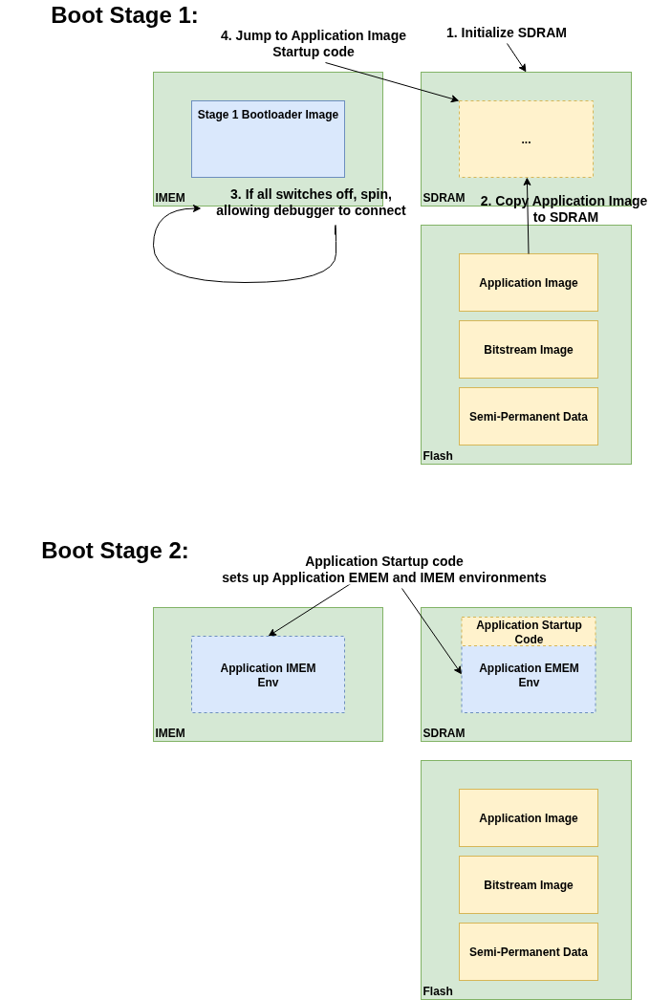

# The Bootloader

**Bootloader Software Project in the BoxLambda Directory Tree**:
 [sw/projects/bootloader](https://github.com/epsilon537/boxlambda/tree/master/sw/projects/bootloader)

## On Verilator

The Bootloader is only used on FPGA. On Verilator, the CPU boots from IMEM. The test program is built into IMEM
and executes from there without requiring any pre-setup steps from a bootloader.

## On FPGA

This is the boot sequence on FPGA:

1. The CPU boots from address `0x11500080`, located in flash memory. This is the entry point to the bootloader.
2. The bootloader copies itself from flash to IMEM and jumps to its entry point in IMEM.
3. The bootloader initializes SDRAM (EMEM).
4. Using a magic number check, the bootloader detects the presence of an application
image at flash memory location `0x11600000`. If an image is detected, it is copied to EMEM, starting at EMEM
memory offset 0.
5. The bootloader checks the switch settings. If all four switches are in the *off* position, the
bootloader will spin in a loop, allowing a debugger to connect. If the switches
are not all in the off position, the bootloader will start the application by
jumping to its entry point at address `0x20000008` in EMEM.
6. The application start-up code creates code/data/BSS sections in IMEM and/or EMEM as it sees fit.

*The Bootloader*

It's worth noting that the bootloader as well as the application
images are complete, standalone C/C++ programs built against PicoLibc and using
the usual CRT0 start-up sequence to set up the C/C++ environment. The bootloader
is built using the [link_bootloader.ld]() link script, the application image is
based on either the [link_ddr_to_ddr_boot.ld]() script or the [link_ddr_to_imem_boot.ld](),
depending on whether the application executes from EMEM or IMEM after start-up.

## Building and Flashing the Bootloader

For instructions to build and flash the Bootloader, see [this section](installation.md#installing-the-boxlambda-base-bitstream-bootloader-and-os).

