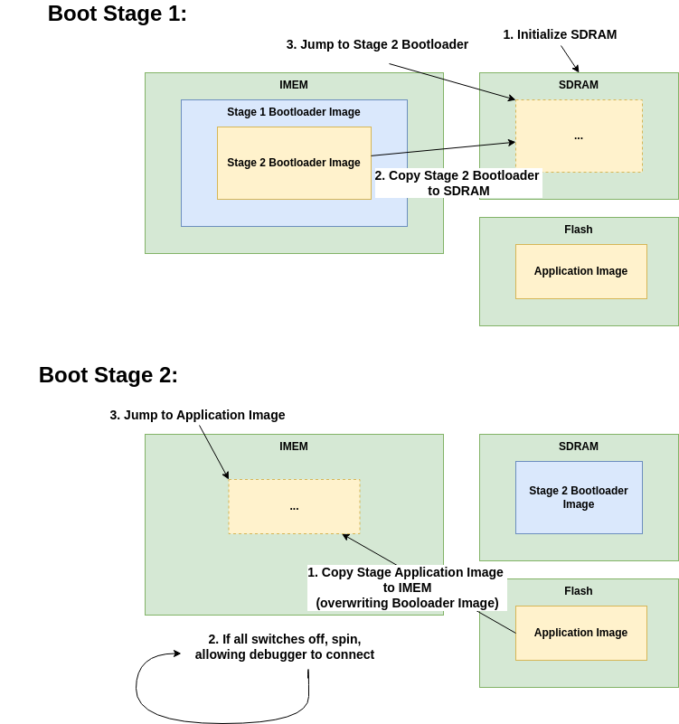

---
hide:
  - toc
---

# The Bootloader

**Bootloader Software Project in the BoxLambda Directory Tree**:
 [sw/projects/bootloader](https://github.com/epsilon537/boxlambda/tree/master/sw/projects/bootloader)

The bootloader is the default IMEM internal memory image. The program initializes
SDRAM and loads an application image from flash memory into IMEM. The bootloader
then checks the switch settings. If all four switches are in the off position, the
bootloader will spin in a loop, allowing a debugger to connect. If the switches
are not all in the off position, the bootloader will start the application by
jumping to its start vector at address `0x80`.

To prevent the boot loader from overwriting itself when loading the application
image into IMEM, the boot process is split into two stages as shown in the
diagram below:

*The Two-Stage Bootloader*

It's worth noting that the stage 1 and 2 bootloaders as well as the application
images are complete, standalone C/C++ programs built against PicoLibc and using
the usual CRT0 start-up sequence to set up the C/C++ environment. The Stage 1 Bootloader
and the application images ar built using the [link_imem_boot.ld]() link script
which maps the heap to SDRAM and all other program segments to IMEM. The Stage 2
Bootloader is built the [link_ddr_boot.ld]() link script which maps all program
segments to SDRAM.
