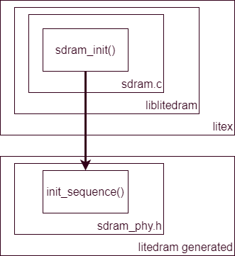

---
hide:
  - toc
---

- **LiteX Repo**, BoxLambda fork, `boxlambda` branch:
  [https://github.com/epsilon537/litex](https://github.com/epsilon537/litex).

- **LiteX Submodule in the BoxLambda Directory Tree**:
  `boxlambda/sub/litex/`.

- **SDRAM Software Component in the BoxLambda Directory Tree**: [boxlambda/sw/components/sdram](https://github.com/epsilon537/boxlambda/tree/master/sw/components/sdram)

## LiteDRAM Initialization

When the LiteDRAM core is generated (during the code generation step of a gateware project build), the core's CSR register accessors for software are also generated in the build tree's `codegen/` directory:

```
build/[sim|arty]-a7-100/codegen/litedram/sw/include/generated/
├── csr.h
├── git.h
├── mem.h
├── sdram_phy.h
└── soc.h``
```

The most relevant files are `csr.h` and `sdram_phy.h`. They contain the register definitions and constants used by the memory initialization code.

### *Sdram_init()*

In addition to register definitions, `sdram_phy.h` contains a function called `init_sequence()`. This function gets invoked as part of a more elaborate initialization function called `sdram_init()`. `Sdram_init()` is *not* part of the generated code, however. It's part of `sdram.c`, which is part of `liblitedram`, which is part of the base Litex repository (*not* the LiteDRAM repository):

[https://github.com/epsilon537/litex/tree/master/litex/soc/software/liblitedram](https://github.com/epsilon537/litex/tree/master/litex/soc/software/liblitedram)



*sdram_init() vs. init_sequence().*

The `sdram_init()` function is part of the `sdram` software component in the BoxLambda code base.

### The DDR Test Application

The DDR test program is located here:

[https://github.com/epsilon537/boxlambda/blob/master/sw/projects/ddr_test/ddr_test.c](https://github.com/epsilon537/boxlambda/blob/master/sw/projects/ddr_test/ddr_test.c)

The program boots from internal memory. It invokes `sdram_init()`, performs a memory test, and verifies CPU instruction execution from DDR by relocating a test function from internal memory to DDR and branching to it.

