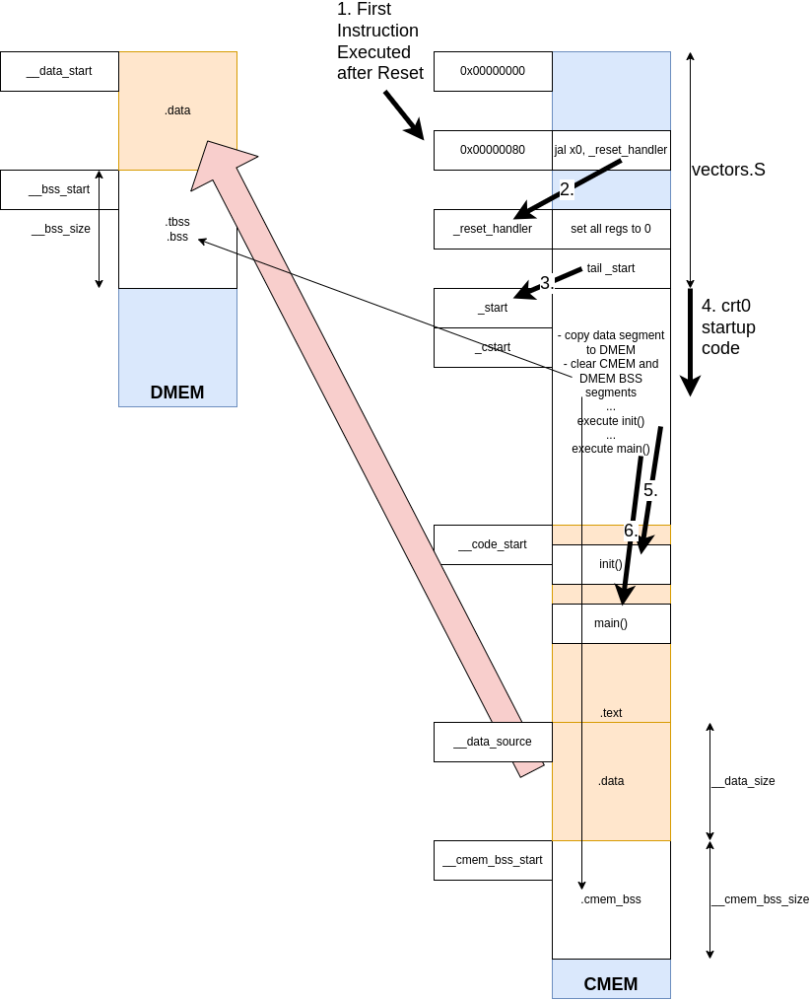

## Picolibc and Bootstrap

- **PicoLibc Version**: 1.8.6

- **PicoLibc Repo**, BoxLambda fork, *boxlambda* branch:
    [https://github.com/epsilon537/picolibc](https://github.com/epsilon537/picolibc)

- **PicoLibc Submodule in the BoxLambda Directory Tree**:
    boxlambda/sub/picolibc/.

- **PicoLibc Website**:
    [https://keithp.com/picolibc/](https://keithp.com/picolibc/)

- **Bootstrap Software Component in the BoxLambda Directory Tree**:
  [boxlambda/sw/components/bootstrap](https://github.com/epsilon537/boxlambda/tree/master/sw/components/bootstrap)

BoxLambda uses the Picolibc standard C library implementation.
[Picolibc](https://github.com/picolibc/picolibc) is a Newlib variant, blended with AVR libc, optimized for systems with limited memory.
[Newlib](https://www.sourceware.org/newlib/) is the de-facto standard C library implementation for embedded systems.

### Building Picolibc

#### Picolibc Configuration Scripts - RV32IMC
A Picolibc build for a new system requires configuration scripts for that system in the [picolibc/scripts/](https://github.com/epsilon537/picolibc/tree/3cd5bea5ad034d574670a7a85b2221d26224b588/scripts) directory. The scripts are named after the selected processor configuration. They specify such things as the compiler toolchain to use, GCC processor architecture flags, and CPP preprocessor flags tweaking specific library features.

I'm using RISCV ISA-string **rv32imc** as the base name for the new scripts I'm creating. This corresponds with the default **-march** value of BoxLambda's GCC toolchain:

```
riscv32-unknown-elf-gcc -Q --help=target
The following options are target-specific:
  -mabi=                                ilp32
  -malign-data=                         xlen
  -march=                               rv32imc
  -mbranch-cost=N                       0
  -mcmodel=                             medlow
  -mcpu=PROCESSOR
  -mdiv                                 [disabled]
  -mexplicit-relocs                     [disabled]
  -mfdiv                                [disabled]
  -misa-spec=                           2.2
  -mplt                                 [enabled]
  -mpreferred-stack-boundary=           0
  -mrelax                               [enabled]
  -mriscv-attribute                     [enabled]
  -msave-restore                        [disabled]
  -mshorten-memrefs                     [enabled]
  -msmall-data-limit=N                  8
  -mstrict-align                        [disabled]
  -mtune=PROCESSOR

  Supported ABIs (for use with the -mabi= option):
    ilp32 ilp32d ilp32e ilp32f lp64 lp64d lp64f

  Known code models (for use with the -mcmodel= option):
    medany medlow

  Supported ISA specs (for use with the -misa-spec= option):
    2.2 20190608 20191213

  Known data alignment choices (for use with the -malign-data= option):
    natural xlen
```

The easiest way to create the new scripts is to derive them from existing scripts for similar platforms. I derived the *rv32imc* configuration files  from the existing *rv32imac* configuration files:

- [do-rv32imc-configure](https://github.com/epsilon537/picolibc/blob/boxlambda/scripts/do-rv32imc-configure) is based on [do-rv32imac-configure](https://github.com/epsilon537/picolibc/blob/boxlambda/scripts/do-rv32imac-configure).
- [cross-rv32imc_zicsr.txt](https://github.com/epsilon537/picolibc/blob/boxlambda/scripts/cross-rv32imc_zicsr.txt) is based on [cross-rv32imac_zicsr.txt](https://github.com/epsilon537/picolibc/blob/boxlambda/scripts/cross-rv32imac_zicsr.txt).
- [run-rv32imc](https://github.com/epsilon537/picolibc/blob/3cd5bea5ad034d574670a7a85b2221d26224b588/scripts/run-rv32imc) is based on [run-rv32imac](https://github.com/epsilon537/picolibc/blob/3cd5bea5ad034d574670a7a85b2221d26224b588/scripts/run-rv32imac).

*Zicsr* stands for RISCV Control and Status Registers. These are always enabled on Ibex.

The differences between the derived scripts and the base scripts are minimal:

- They are referencing the *riscv32-unknown-elf* GCC toolchain used by BoxLambda.
- The *-march* flag is set to *rv32imc* (no 'a' - atomic instructions).
- In *do-rv32imc-configure*, picocrt is set to **false**. We're not using the picolibc crt0 module. BoxLambda has its own variant of the crt0 module in the **bootstrap** software component.

#### picolibc_build.sh


With the configuration scripts in place, we can build and install the picolibc library. We have to supply a build directory and an install directory.
I put the build directory in **boxlambda/sw/picolibc-build** and the install directory in **boxlambda/sw/picolibc-install**.

I grouped the PicoLibc build and install instructions in a [picolibc_build.sh](https://github.com/epsilon537/boxlambda/blob/master/scripts/picolibc_build.sh) shell script. The PicoLibc install directory is checked in so there's no need to run the *picolibc_build.sh* as part of the repository setup. The script is only needed in case we want to regenerate the PicoLibc library (e.g. after updating to a newer version of the library).

### Linking against the Picolibc library: The Picolibc GCC specs file

To link the PicoLibc library into an application image, the PicoLibc *spec file* needs to be passed to GCC. The Picolibc GCC specs file expects absolute paths, however. I'm using CMake's *configure_file()* to replace placeholders
in [scripts/picolibc.specs.in](https://github.com/epsilon537/boxlambda/blob/master/scripts/picolibc.specs.in) with the project source directory's absolute path. The resulting *picolibc.specs* is written in the root of the build tree. This way, the Picolibc library build for BoxLambda can be checked into the source tree and the user won't need to build and install it from source when setting up BoxLambda.

The code snippet below is taken from the SW [CMakeList](https://github.com/epsilon537/boxlambda/blob/master/sw/CMakeLists.txt):

```
#The GCC specs file expects absolute paths. I'm using configure_file() to replace placeholders
#in picolibc.specs.in with PROJECT_SOURCE_DIR. The resulting picolibc.specs is written in the root of the build tree.
configure_file(${PROJECT_SOURCE_DIR}/scripts/picolibc.specs.in picolibc.specs @ONLY)

#Set the generated specs files as standard compile and link options.
set(SPECS "--specs=${CMAKE_CURRENT_BINARY_DIR}/picolibc.specs")
add_compile_options(${SPECS})
add_link_options(${SPECS} "LINKER:--gc-sections")
```

### Bootstrap

#### Some Glue Required


*Picolibc on BoxLambda.*

Picolibc is a relatively generic code base that needs to be tied to the platform it's running on to function properly. To bring up the library on BoxLambda, we need to supply three pieces of code:

- A Vector Table
- A Link Map
- Standard IO Setup

More detail for each of these follows in the subsections below. I have grouped them into a single software component called **bootstrap**:

[https://github.com/epsilon537/boxlambda/tree/master/sw/components/bootstrap](https://github.com/epsilon537/boxlambda/tree/master/sw/components/bootstrap)

An application wishing to use the standard C library has to link in this bootstrap component along with the PicoLibc library itself.

#### The Vector Table

The vector table is a table with code entry points for all sorts of CPU events: interrupts, exceptions, etc. The Boot/Reset Vector, i.e. the very first instruction executed when the CPU comes out of reset, is part of this table.

The Vector Table file is located at [boxlambda/sw/components/bootstrap/vectors.S](https://github.com/epsilon537/boxlambda/blob/master/sw/components/bootstrap/vectors.S).

The Ibex Boot/Reset vector is at offset 0x80. After some CPU register initialization, the code branches off to **_start**, the entry point into the **crt0** module.

For more info on vectors.S, check the [Interrupt Handling](sw_comp_irqs.md) page.

#### Crt0

*Crt0*, C-Run-Time-0, is the start-up code in charge of setting up a C environment (zeroing the BSS segment, setting up the stack, etc.) before calling **main()**.
BoxLambda's version of crt0 can be found here:

[boxlambda/sw/components/bootstrap/crt0.c](https://github.com/epsilon537/boxlambda/blob/master/sw/components/bootstrap/crt0.c).
[boxlambda/sw/components/bootstrap/crt0.h](https://github.com/epsilon537/boxlambda/blob/master/sw/components/bootstrap/crt0.h).

BoxLambda's crt0 is based on the Picolibc implementation, with modifications to accommodate the relocation of sections to BoxLambda's CMEM and DMEM internal memories.

#### Standard Input, Output, and Error

The PicoLibc integrator needs to supply *stdin*, *stdout*, and *stderr* instances and associated *getc()* and *putc()* implementations to connect them to an actual IO device.
We'll be using the UART as our IO device for the time being. Down the road, we can extend that with keyboard input and screen output implementation.

```
static struct uart *uartp = 0;

static int uart_putc(char c, FILE *file) {
  int res;

  (void) file;		/* Not used in this function */

  if (!uartp) {
    res = EOF;
  }
  else {
    while (!uart_tx_ready(uartp));
    uart_tx(uartp, (uint8_t)c);
    res = (int)c;
  }

  return res;
}

static int uart_getc(FILE *file) {
  int c;
  (void) file;		/* Not used in this function */

  if (!uartp) {
    c = EOF;
  }
  else {
    while (!uart_rx_ready(uartp));
    c = (int)uart_rx(uartp);
  }

  return c;
}

static FILE __stdio = FDEV_SETUP_STREAM(uart_putc,
					uart_getc,
					NULL,
					_FDEV_SETUP_RW);


FILE *const stdin = &__stdio;
FILE *const stdout = &__stdio;
FILE *const stderr = &__stdio;

void set_stdio_to_uart(struct uart *uart) {
  uartp = uart;
}
```

[boxlambda/sw/components/bootstrap/stdio_to_uart.c](https://github.com/epsilon537/boxlambda/blob/master/sw/components/bootstrap/stdio_to_uart.c)

The **set_stdio_to_uart()** function is to be called from the application before any standard library calls that require standard IO. The application needs to provide a pointer to an initialized *uart* object.

#### The Linker Script

Through a *linker script* we tell the linker where in memory to place the program code, data, and stack. The BoxLambda linker script is based on the one provided by PicoLibc, with modifications for BoxLambda's *CMEM*/*DMEM*/*EMEM*/*flash* memory architecture.

The Linker Script defines the following:

- Relevant Memories on the target device: In the case of BoxLambda, these are *cmem*, *dmem*, *emem* (=DDR memory), and *flash*.
```
MEMORY
{
    flash : ORIGIN = __flash, LENGTH = __flash_size
    cmem : ORIGIN = __cmem, LENGTH = __cmem_size
    dmem : ORIGIN = __dmem, LENGTH = __dmem_size
    emem : ORIGIN = __emem, LENGTH = __emem_size
}
```
- The mapping of input to output sections. Input sections are defined in the source code and default to .text, .bss, and .data when not explicitly specified. The output sections for BoxLambda are: *.flash*, *.text*, *.cmem_bss*, *.data*, *.tdata*, *.tbss*, *.bss*, *.heap* and *.stack*.
```
    .text : {
        ...
        *(.text.unlikely .text.unlikely.*)
        *(.text.startup .text.startup.*)
        *(.text .text.*)
        *(.gnu.linkonce.t.*)
    ...
```
- The mapping of output sections to memories and, for sections that require relocation, the memory from which to load them. For executables built to boot from Flash, the load memory will be the *flash* memory. For executables built to boot from CMEM, *cmem* will be used as the load memory.
```
    ...
    .text : {...
    } >cmem AT>flash
    ...
    .data : ALIGN_WITH_INPUT {...
    } >dmem AT>flash
    ...
    .bss (NOLOAD) : {
    } >dmem
```
  - Code sections go to *cmem*.
  - Data, BSS, and stack sections go to *dmem*.
  - The *.cmem_bss* section goes to *cmem*.
  - The heap goes to *emem*.
- Symbols used by the CRT0 code for section relocation, BSS initialization, etc. For BoxLambda, the key symbols are:
    - *__code_source / __code_start / __code_size*: source address, destination address, and size of the code section to relocate from flash to CMEM. In the Boot-from-CMEM sequence, *__code_source* and *__code_start* point to the same CMEM address.
    - *__data_source / __data_start / __data_size*: source address, destination address, and size of the data section to relocate from flash or CMEM to DMEM.
    - *__bss_start / __bss_size*: Address and size of BSS section in DMEM to zero out.
    - *__cmem_bss_start / __cmem_bss_size*: Address and size of BSS section in CMEM to zero out.
```
    .text : {
        PROVIDE(__code_start = ADDR(.text));
        ...
        PROVIDE(__code_end = .);
    } >cmem AT>flash
    PROVIDE(__code_source = LOADADDR(.text));
    PROVIDE(__code_size = __code_end - __code_start );
    ...
```

BoxLambda has two linker scripts:

- [link_cmem_boot.ld](https://github.com/epsilon537/boxlambda/blob/master/sw/components/bootstrap/link_cmem_boot.ld): For software images that boot from CMEM.
- [link_flash_boot.ld](https://github.com/epsilon537/boxlambda/blob/master/sw/components/bootstrap/link_flash_boot.ld): For software images that boot from Flash.

BoxLambda does not have separate linker scripts for the Arty-A7-35T and the Arty-A7-100T. The CMEM and DMEM sizes are passed to the linker via symbols defined by the build system. They are not defined inside the linker script, which means the same script can be used for the Arty-A7-35T and the Arty-A7-100T.

```
  #Pass linker script and picolibc specs to linker, and define __cmem_size and __dmem_size symbols.
  target_link_options(${_tgt}
        PRIVATE
            -T${_link_script}
            "--specs=${CMAKE_BINARY_DIR}/sw/picolibc.specs"
            "LINKER:--defsym=__cmem_size=${CMEM_SIZE}"
            "LINKER:--defsym=__dmem_size=${DMEM_SIZE}"
            "LINKER:--gc-sections"
            "LINKER:--Map,${CMAKE_CURRENT_BINARY_DIR}/${_tgt}.map"
    )
```

###### .cmem_bss and .dmem_text

The linker script contains a **.cmem_bss** section, mapped to CMEM, so it is possible to put data in CMEM by assigning it to this section.
```
/*Create some data buffers in CMEM by mapping them to the .cmem_bss segment.*/
char cmem_str[32] __attribute__ ((section (".cmem_bss")));
```

Similarly, the **.dmem_text** section allows code to be put in DMEM.
```
/*This function executes from DMEM.*/
__attribute__ ((section(".dmem_text")))
int code_in_dmem(char *message) {
    int i, j;
...
```

#### Boot Sequence

BoxLambda currently supports two boot sequences: **Boot-from-Flash** and **Boot-from-CMEM**.

##### Boot-from-Flash Sequence


*The Software Boot-from-Flash Sequence.*

Note that, technically, BoxLambda doesn't boot from Flash Memory. It boots from CMEM at address offset 0x80. There, it executes the early startup code defined in *vectors.S* before jumping to the CRT0 code located in Flash Memory.
I could have just pointed the Ibex Boot Vector to Flash Memory. However, I already have so many test programs that execute directly from CMEM, I decided to keep the Boot-from-CMEM feature, and from there branch to Flash Memory if so desired. The CMEM software program that branches to the flash boot code (i.e. containing just *vectors.S*) is located here:

[https://github.com/epsilon537/boxlambda/tree/master/sw/projects/cmem_to_flash_vector](https://github.com/epsilon537/boxlambda/tree/master/sw/projects/cmem_to_flash_vector)

##### Boot-from-CMEM Sequence



*The Software Boot-from-CMEM Sequence.*

In the Boot-from-CMEM sequence, CMEM is used as the load region. The data segment is relocated from CMEM to DMEM. The code segment can stay where it is.

### Example Program

Here's an example application program using Picolibc:

```
#include <stdio.h>
#include <string.h>
#include "stdio_to_uart.h"
#include "uart.h"
#include "platform.h"

static struct uart uart0;

//_init is executed by picolibc startup code before main().
void _init(void) {
  //Set up UART and tie stdio to it.
  uart_init(&uart0, (volatile void *) PLATFORM_UART_BASE);
  uart_set_baudrate(&uart0, 115200, PLATFORM_CLK_FREQ);
  set_stdio_to_uart(&uart0);
}

int main(void) {
  int v = 123;
  static char m[10] = {0};
  char c;

  //Some basic libc tests:

  memset(m, '!', sizeof(m)-1);

  printf("printf in main() v=%d, m=%s.\n", v, m);

  printf("Enter character: ");
  c = getc(stdin);
  printf("Character entered: ");
  putc(c, stdout);

  return 0;
}
```


Notice the **_init()** function. This function is executed by the PicoLibc startup code before calling **main()**. This is where we set up the UART and stdio.

### Memory Footprint

|                        | Code (KB) | RO-Data (KB) | RW-Data (KB) |
| ---------------------- | ----------| ------------ | ------------ |
| Picolibc + GCC         | 9.6       | 1.3          | 0.1          |
| Stack                  | 0         | 0            | 0.5          |

