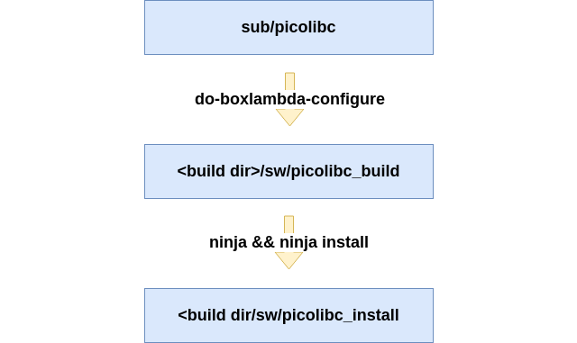

---
hide:
  - toc
---

## Picolibc and Bootstrap

- **PicoLibc Version**: 1.8.6

- **PicoLibc Repo**, BoxLambda fork, `boxlambda` branch:
    [https://github.com/epsilon537/picolibc](https://github.com/epsilon537/picolibc)

- **PicoLibc Submodule in the BoxLambda Directory Tree**:
    boxlambda/sub/picolibc/.

- **PicoLibc Website**:
    [https://keithp.com/picolibc/](https://keithp.com/picolibc/)

- **Bootstrap Software Component in the BoxLambda Directory Tree**:
  [boxlambda/sw/components/bootstrap](https://github.com/epsilon537/boxlambda/tree/master/sw/components/bootstrap)

BoxLambda uses the Picolibc standard C library implementation.
[Picolibc](https://github.com/picolibc/picolibc) is a Newlib variant, blended with AVR libc, optimized for systems with limited memory.
[Newlib](https://www.sourceware.org/newlib/) is the de-facto standard C library implementation for embedded systems.

### Building Picolibc

#### Picolibc Configuration Scripts
A Picolibc build for a new system requires configuration scripts for that system in the [picolibc/scripts/](https://github.com/epsilon537/picolibc/tree/boxlambda/scripts) directory. They specify such things as the compiler toolchain to use, GCC processor architecture flags, and CPP preprocessor flags tweaking specific library features.

I'm using `boxlambda` as the base name for the new scripts.

The new scripts are derived from the existing configuration files for `rv32imac`:

- [do-boxlambda-configure](https://github.com/epsilon537/picolibc/blob/boxlambda/scripts/do-boxlambda-configure) is based on [do-rv32imac-configure](https://github.com/epsilon537/picolibc/blob/boxlambda/scripts/do-rv32imac-configure).
- [cross-boxlambda.txt](https://github.com/epsilon537/picolibc/blob/boxlambda/scripts/cross-boxlambda.txt) is based on [cross-rv32imac_zicsr.txt](https://github.com/epsilon537/picolibc/blob/boxlambda/scripts/cross-rv32imac_zicsr.txt).

The differences between the derived scripts and the base scripts are minimal:

- They are referencing the `riscv32-boxlambda-elf` GCC toolchain.
- The `-march` flag is set to `rv32im_zicsr`.
- In `do-boxlambda-configure`, `picocrt` is set to `false`. We're not using the picolibc crt0 module. BoxLambda has its own variant of the crt0 module in the `bootstrap` software component.

#### picolibc_build.sh


I grouped the PicoLibc build and install instructions in a [picolibc_build.sh](https://github.com/epsilon537/boxlambda/blob/master/scripts/picolibc_build.sh) shell script. This script is invoked by the build system (in [sw/CMakeLists.txt](https://github.com/epsilon537/boxlambda/blob/master/sw/CMakeLists.txt)) during build tree configuration time. The picolibc build and install directories are placed inside the build tree:

- **Picolibc build directory**: `<build dir>/sw/piclobc-build`
- **Picolibc install directory**: `<build dir>/sw/piclobc-install`

When there are changes in the Picolibc source tree, the build trees need to be re-generated. The easiest way to do that is by running `make regen` from the build tree.

### Linking against the Picolibc library: The Picolibc GCC specs file

To link the PicoLibc library into an application image, the PicoLibc *specs file* needs to be passed to GCC. `sw/CMakeLists.txt` takes care of this:

```
#Set the generated specs files as standard compile and link options.
set(SPECS "--specs=${CMAKE_CURRENT_BINARY_DIR}/picolibc-install/picolibc.specs")

#Use the picolibc specs for all compilations.
add_compile_options(
    $<$<COMPILE_LANGUAGE:CXX,C,ASM>:${SPECS}>)

add_link_options(
    $<$<COMPILE_LANGUAGE:CXX,C,ASM>:${SPECS}>)
```

The Picolibc GCC specs file can be found in the Picolib install directorty.

### Bootstrap

#### Some Glue Required


*Picolibc on BoxLambda.*

Picolibc is a relatively generic code base that needs to be tied to the platform it's running on to function properly. To bring up the library on BoxLambda, we need to supply three pieces of code:

- A Vector Table
- A Link Map
- Standard IO Setup

More detail for each of these follows in the subsections below. I have grouped them into a single software component called **bootstrap**:

[https://github.com/epsilon537/boxlambda/tree/master/sw/components/bootstrap](https://github.com/epsilon537/boxlambda/tree/master/sw/components/bootstrap)

An application using the standard C library has to link in this bootstrap component.

#### The Vector Table

The vector table is a table with code entry points for all sorts of CPU events: interrupts, exceptions, etc. The Boot/Reset Vector, i.e. the very first instruction executed when the CPU comes out of reset, is part of this table.

The Vector Table file is located at [boxlambda/sw/components/bootstrap/vectors.S](https://github.com/epsilon537/boxlambda/blob/master/sw/components/bootstrap/vectors.S).

The Ibex Boot/Reset vector is at offset 0x80. After some CPU register initialization, the code branches off to `_start`, the entry point into the `crt0` module.

For more info on vectors.S, check the [Interrupt Handling](sw_comp_irqs.md) page.

#### Crt0

*Crt0*, C-Run-Time-0, is the start-up code in charge of setting up a C environment (zeroing the BSS segment, setting up the stack, etc.) before calling `main()`.
BoxLambda's version of crt0 can be found here:

[boxlambda/sw/components/bootstrap/crt0.c](https://github.com/epsilon537/boxlambda/blob/master/sw/components/bootstrap/crt0.c).
[boxlambda/sw/components/bootstrap/crt0.h](https://github.com/epsilon537/boxlambda/blob/master/sw/components/bootstrap/crt0.h).

#### Standard Input, Output, and Error

The PicoLibc integrator needs to supply `stdin`, `stdout`, and `stderr` instances and associated `getc()` and `putc()` implementations to connect them to an actual IO device.
We'll be using the UART as our IO device for the time being. Down the road, we can extend that with keyboard input and screen output implementation.

```
static struct uart *uartp = 0;

static int uart_putc(char c, FILE *file) {
  int res;

  (void) file;		/* Not used in this function */

  if (!uartp) {
    res = EOF;
  }
  else {
    while (!uart_tx_ready(uartp));
    uart_tx(uartp, (uint8_t)c);
    res = (int)c;
  }

  return res;
}

static int uart_getc(FILE *file) {
  int c;
  (void) file;		/* Not used in this function */

  if (!uartp) {
    c = EOF;
  }
  else {
    while (!uart_rx_ready(uartp));
    c = (int)uart_rx(uartp);
  }

  return c;
}

static FILE __stdio = FDEV_SETUP_STREAM(uart_putc,
					uart_getc,
					NULL,
					_FDEV_SETUP_RW);


FILE *const stdin = &__stdio;
FILE *const stdout = &__stdio;
FILE *const stderr = &__stdio;

void set_stdio_to_uart(struct uart *uart) {
  uartp = uart;
}
```

[boxlambda/sw/components/bootstrap/stdio_to_uart.c](https://github.com/epsilon537/boxlambda/blob/master/sw/components/bootstrap/stdio_to_uart.c)

The `set_stdio_to_uart()` function is to be called from the application before any standard library calls that require standard IO. The application needs to provide a pointer to an initialized *uart* object.

#### The Linker Script

Through a *linker script*, we tell the linker where in memory to place the program code, data, and stack.

The Linker Script defines the following:

- Relevant Memories on the target device: In the case of BoxLambda, these are `imem`, `emem` (=DDR memory), and `flash`.
```
MEMORY
{
    flash : ORIGIN = __flash, LENGTH = __flash_size
    imem : ORIGIN = __imem, LENGTH = __imem_size
    emem : ORIGIN = __emem, LENGTH = __emem_size
}
```
- The mapping of input to output sections. Input sections are defined in the source code and default to .text, .bss, and .data when not explicitly specified. The output sections for BoxLambda are: `.flash`, `.text`, `.data`, `.tdata`, `.tbss`, `.bss`, `.heap`, and `.stack`.
```
    .text : {
        ...
        *(.text.unlikely .text.unlikely.*)
        *(.text.startup .text.startup.*)
        *(.text .text.*)
        *(.gnu.linkonce.t.*)
    ...
```
- The mapping of output sections to memories and, for sections that require relocation, the memory from which to load them. For executables built to boot from flash, the load memory will be the *flash* memory. For executables built to boot from IMEM, *imem* will be used as the load memory.
```
    ...
    .text : {...
    } >imem AT>flash
    ...
    .data : ALIGN_WITH_INPUT {...
    } >imem AT>flash
    ...
    .bss (NOLOAD) : {
    } >imem
```
  - Code, Data, BSS, and stack sections go to `imem`.
  - The heap goes to `emem`.
- Symbols used by the CRT0 code for section relocation, BSS initialization, etc. For BoxLambda, the key symbols are:
    - `__code_source / __code_start / __code_size`: source address, destination address, and size of the code section to relocate from flash to IMEM. In the Boot-from-IMEM sequence, `__code_source` and `__code_start` point to the same IMEM address.
    - `__data_source / __data_start / __data_size`: source address, destination address, and size of the data section to relocate from flash to IMEM. In the Boot-from-IMEM sequence; `__data_source` and `__data_start` point to the same IMEM address.
    - `__bss_start / __bss_size`: Address and size of BSS section in IMEM to zero out.
```
    .text : {
        PROVIDE(__code_start = ADDR(.text));
        ...
        PROVIDE(__code_end = .);
    } >imem AT>flash
    PROVIDE(__code_source = LOADADDR(.text));
    PROVIDE(__code_size = __code_end - __code_start );
    ...
```

BoxLambda has two linker scripts:

- [link_imem_boot.ld](https://github.com/epsilon537/boxlambda/blob/master/sw/components/bootstrap/link_imem_boot.ld): For software images that boot from IMEM.
- [link_flash_boot.ld](https://github.com/epsilon537/boxlambda/blob/master/sw/components/bootstrap/link_flash_boot.ld): For software images that boot from Flash.

The IMEM size is passed to the linker via symbols defined by the build system ([sw/projects/CMakeLists.txt](https://github.com/epsilon537/boxlambda/blob/master/sw/projects/CMakeLists.txt)).

```
  target_link_options(${_tgt}
        PRIVATE
            # Don't use Picolibc's crt0. We provide our own crt0 in
            # sw/components/bootstrap
            -nostartfiles
            -T${_link_script}
            "LINKER:--defsym=__imem_size=${IMEM_SIZE}"
            "LINKER:--gc-sections"
            "LINKER:--Map,${CMAKE_CURRENT_BINARY_DIR}/${_tgt}.map"
    )
```

#### Boot Sequence

BoxLambda currently supports two boot sequences: **Boot-from-Flash** and **Boot-from-IMEM**.

##### Boot-from-Flash Sequence

[](assets/spiflash_boot_sequence.png)

*The Software Boot-from-Flash Sequence.*

Technically, BoxLambda doesn't boot from flash memory. It boots from IMEM at address offset 0x80. There, it executes the early startup code defined in `vectors.S` before jumping to the CRT0 code located in flash memory.

The Ibex Boot Vector is part of a vector table that also includes the interrupt vectors. For the purpose of low-latency interrupt handling, it's important to keep this vector table in IMEM, rather than (slow) flash memory.

The software project that branches from IMEM to the flash boot code (i.e., containing just `vectors.S`) is located here:

[https://github.com/epsilon537/boxlambda/tree/master/sw/projects/imem_to_flash_vector](https://github.com/epsilon537/boxlambda/tree/master/sw/projects/imem_to_flash_vector)

##### Boot-from-IMEM Sequence


*The Software Boot-from-CMEM Sequence.*

In the Boot-from-CMEM sequence, CMEM is used as the load region. The data segment is relocated from CMEM to DMEM. The code segment can stay where it is.

### Example Program

Here's an example application program using Picolibc:

```
#include <stdio.h>
#include <string.h>
#include "stdio_to_uart.h"
#include "uart.h"
#include "platform.h"

static struct uart uart0;

//_init is executed by picolibc startup code before main().
void _init(void) {
  //Set up UART and tie stdio to it.
  uart_init(&uart0, (volatile void *) PLATFORM_UART_BASE);
  uart_set_baudrate(&uart0, 115200, PLATFORM_CLK_FREQ);
  set_stdio_to_uart(&uart0);
}

int main(void) {
  int v = 123;
  static char m[10] = {0};
  char c;

  //Some basic libc tests:

  memset(m, '!', sizeof(m)-1);

  printf("printf in main() v=%d, m=%s.\n", v, m);

  printf("Enter character: ");
  c = getc(stdin);
  printf("Character entered: ");
  putc(c, stdout);

  return 0;
}
```


Notice the `_init()` function. This function is executed by the PicoLibc startup code before calling `main()`. This is where we set up the UART and stdio.

