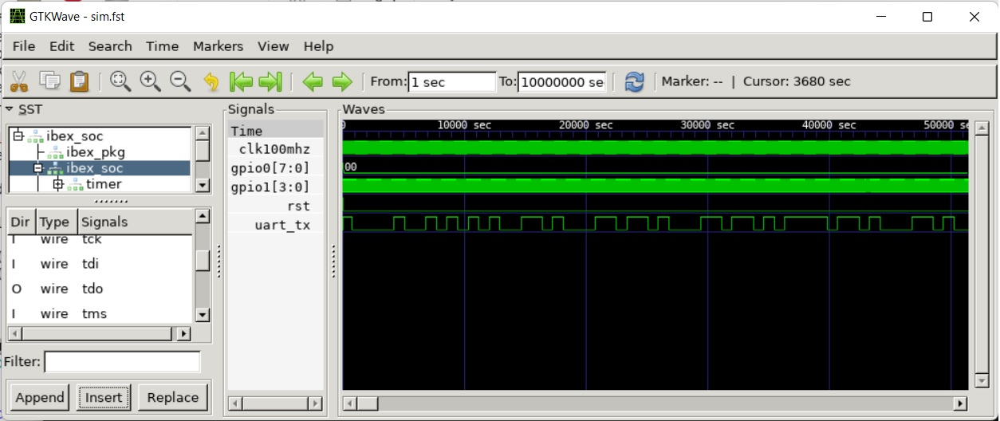

---
hide:
  - toc
---
# The System-Level Test Bench
The system-level test bench should allow for the following:

- Executing system-level test cases within a reasonable time frame. System-level test cases refer to those where the DUT (Device Under Test) is the SoC (System on Chip).
- A short lather-rinse-repeat cycle for making code changes and testing them on a system-level DUT.
- Full signal visibility into the build to aid in test case development and debugging.
- *Reasonably* easy automated testing, with the caveat that automated testing is never truly *easy*.

## Verilator

BoxLambda uses Verilator to create system test benches. Verilator is a compiler that compiles, or rather *verilates*, an HDL design into a C++ model. It then incorporates any user-provided C++ testbench/wrapper code and compiles the entire setup into an executable, optionally with the ability to generate traces.

C++ is not the ideal language for test case development, but it gets the job done, and since it is a compiled language, it is *fast*.

## A Simple Test Bench

The proof-of-concept system test bench for BoxLambda is based on the example code included in the Verilator distribution:

[https://github.com/verilator/verilator/blob/master/examples/make_tracing_c/sim_main.cpp](https://github.com/verilator/verilator/blob/master/examples/make_tracing_c/sim_main.cpp)

I have included `UARTSIM`, the UART co-simulation class provided by ZipCPU along with the UART Verilog implementation in the `wbuart32` repository:

[https://github.com/epsilon537/wbuart32/tree/master/bench/cpp](https://github.com/epsilon537/wbuart32/tree/master/bench/cpp)

The test bench performs the following tasks:

1. Instantiate the verilated *Hello World* model and the UARTSIM co-simulation object.
2. Optionally, enable tracing via a command-line option.
3. Optionally, wait for an OpenOCD connection, controlled by a command-line option.
4. Run the model for a fixed number of clock cycles.
5. While running the model:
   1. Feed characters into UARTSIM's transmit path, i.e., towards the model.
   2. Feed the model's UART output to UARTSIM, and UARTSIM's output to the model's UART input.
   3. Capture and display the decoded UARTSIM output and GPIO outputs.

6. Pass/Fail criterion: After running the model for the set number of clock cycles, compare the captured UART and GPIO outputs against the expected results.

Here is the source code for the proof-of-concept test bench:

[https://github.com/epsilon537/boxlambda/blob/master/gw/projects/hello_world/sim/sim_main.cpp](https://github.com/epsilon537/boxlambda/blob/master/gw/projects/hello_world/sim/sim_main.cpp)

Other, more elaborate system test benches include:

- [*gw/projects/vera_integrated/sim/sim_main.cpp*](https://github.com/epsilon537/boxlambda/blob/master/gw/projects/vera_integrated/sim/sim_main.cpp): This test bench captures the DUT's VGA output and renders it to an SDL frame buffer.
- [*gw/projects/sdspi_test/sim/sim_main.cpp*](https://github.com/epsilon537/boxlambda/blob/master/gw/projects/sdspi_test/sim/sim_main.cpp): This test bench includes ZipCPU's SDSPISIM co-simulator.
- [*gw/projects/ym2149_dac_test/sim/sim_main.cpp*](https://github.com/epsilon537/boxlambda/blob/master/gw/projects/ym2149_dac_test/sim/sim_main.cpp): This test bench captures the Audio DAC bitstream and PSG's PCM output, saving it to two Python files for further analysis by a Python script.

## Are We Running in a Simulation?

Software running on Ibex needs to know whether it's running in a simulation or on FPGA, so it can adjust timings, such as the LED blink period. I'm using GPIO1 bits 3:0 for this purpose. In a simulation, I set these bits to `4'bf`, and on FPGA, I set them to something else.

The `hello.c` test program includes the following check:

```c
  //GPIO1 bits3:0 = 0xf indicate we're running inside a simulator.
  if ((gpio_get_input(&gpio1) & 0xf) == GPIO1_SIM_INDICATOR)
    uart_printf(&uart0, "This is a simulation.\n");
  else
    uart_printf(&uart0, "This is not a simulation.\n");
```

## Files and Command-Line Options

All files created by Verilator go into the `<build_dir\>/gw/projects/<project\>` directory. The name of the generated executable is `Vmodel`. As you can see in the `sim_main.cpp` source code, `Vmodel` accepts a few command-line options:

- `Vmodel -t`: Execute with waveform tracing enabled. The program generates a `.fst` trace file in the current directory. `.fst` files can be viewed with **gtkwave**.


*Gtkwave view of waveform trace generated by the *Hello World* Verilator test bench.*

- `Vmodel -i`: Run in interactive mode, as opposed to the default batch mode. In interactive mode, the program may wait for keypresses. Batch mode is used for non-interactive automated testing.

## Running Regression Tests

CMake comes with a regression test framework called **Ctest**. BoxLambda regression tests are only defined in a simulation build tree. To see a list of available test cases, you need to first build everything and then run the `ctest -N` command to list the test cases:

```bash
cd <boxlambda root dir>/build/sim
make all
ctest -N
```

You should see something like this:

```
Test project /home/epsilon/work/boxlambda/build/sim2
  Test #1: hello_world_test
  Test #2: hello_dbg_test
  Test #3: picolibc_test_test
  Test #4: ddr_test_test

Total Tests: 4
```

To run a specific test, use the following command from the build directory:

```bash
ctest -I <test number>
```

To run all tests, simply run the `ctest` command without any parameters.

