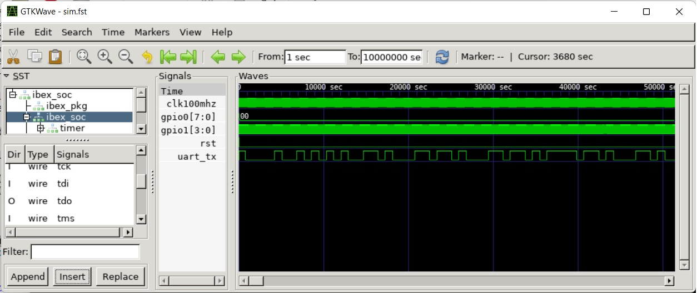

The Test Bench
==============
Because BoxLambda for the most part integrates existing components that have already been verified by their respective owners, the focus is on system-level testing rather than component-level verification. In the few areas where BoxLambda does introduce significant new logic, component and/or module-level verification is done. Component-level verification and system-level testing use different test benches.

The System-Level Test Bench
---------------------------
The system-level test bench should allow for the following:

- Execute system-level test cases in a reasonable time frame. With system-level test cases, I mean test cases where the DUT is the SoC.
- A short lather-rinse-repeat cycle of making code changes and testing them on a system-level DUT.
- Full signal visibility into the build, to aid test case development as well as debugging.
- *Reasonably* easy automated testing. With the caveat that automated testing is never truly *easy*.

### Verilator

Boxlambda uses Verilator to create system test benches. Verilator is a compiler. It compiles, or rather *verilates*, an HDL design into a C++ model. It then picks up any user-provided C++ testbench/wrapper code and compiles the whole thing into an executable, optionally with the ability to generate traces.

C++ is not an ideal language for test case development, but it'll get the job done, and it's a compiled language, so it's *fast*. 

### A simple Test Bench

The proof-of-concept system test bench for BoxLambda is based on the example code included in the Verilator distribution:

[https://github.com/verilator/verilator/blob/master/examples/make_tracing_c/sim_main.cpp](https://github.com/verilator/verilator/blob/master/examples/make_tracing_c/sim_main.cpp)

I included *UARTSIM*, the UART co-simulation class that ZipCPU provides along with the UART Verilog implementation in the *wbuart32* repository:

[https://github.com/epsilon537/wbuart32/tree/master/bench/cpp](https://github.com/epsilon537/wbuart32/tree/master/bench/cpp)

The test bench does the following:

1. Instantiate the verilated *Hello World* model and the UARTSIM co-simulation object.
2. Optionally, controlled by a command-line option, enable tracing.
3. Optionally, controlled by a command-line option, wait for an OpenOCD connection.
4. Run the model for a fixed number of clock cycles.
5. While running the model:
    1. Feed characters into UARTSIM's transmit path, i.e. towards the model.
    2. Feed the model's UART output to UARTSIM and UARTSIMs output to the model's UART input.
    3. Capture and display the decoded UARTSIM output and the GPIO outputs.
   
6. Pass/Fail criterium: After running the model for the set number of clock cycles, match the captured UART and GPIO outputs against the expected results.

As suggested by ZipCPU in his Verilog tutorial, I use *nCurses* for positional printing inside the terminal windows. This way, I can easily build a display that refreshes, rather than scrolls, whenever the model produces new UART or GPIO data to display.

Current test bench source code examples: 

- [*gw/projects/hello_world/sim/sim_main.cpp*](https://github.com/epsilon537/boxlambda/blob/master/gw/projects/hello_world/sim/sim_main.cpp).
- [*gw/projects/picolibc_test/sim/sim_main.cpp*](https://github.com/epsilon537/boxlambda/blob/master/gw/projects/picolibc_test/sim/sim_main.cpp).
- [*gw/projects/ddr_test/sim/sim_main.cpp*](https://github.com/epsilon537/boxlambda/blob/master/gw/projects/ddr_test/sim/sim_main.cpp)
- [*gw/projects/vera_integrated*](https://github.com/epsilon537/boxlambda/tree/master/gw/projects/vera_integrated)
- [*gw/projects/sdspi_test*](https://github.com/epsilon537/boxlambda/tree/master/gw/projects/sdspi_test)

### Are we running in a Simulation?

Software running on Ibex needs to know whether it's running in a simulation or on FPGA, so it can adjust timings such as the LED blink period.
I'm using GPIO1 bits 3:0 for this purpose. In a simulation, I set these bits to *4'bf*. On FPGA I set them to something else.
The *hello.c* test program includes the following check:

```
  //GPIO1 bits3:0 = 0xf indicate we're running inside a simulator.
  if ((gpio_get_input(&gpio1) & 0xf) == GPIO1_SIM_INDICATOR)
    uart_printf(&uart0, "This is a simulation.\n");    
  else
    uart_printf(&uart0, "This is not a simulation.\n");
```

### Files and Command Line Options

All files created by Verilator go into the *<build_dir\>/gw/projects/<project\>* directory. The name of the generated executable is **Vmodel**.
As you can see in the *sim_main.cpp* source code, *Vmodel* accepts a few command line options:

- **Vmodel -t**: Execute with waveform tracing enabled. The program generates a *.fst* trace file in the current directory. *.fst* files can be viewed with **gtkwave**.


*Gtkwave View of Waveform Trace Generated by *Hello World* Verilator Test Bench*

- **Vmodel -i**: Run in interactive mode, vs. the default batch mode. In interactive mode, the program may wait for keypresses. Batch mode is used for non-interactive automated testing.

### Running Regression Tests

CMake comes with a regression test framework called **Ctest**. BoxLambda regression tests are only defined in a simulation build tree. To see a list of available test cases, you need to first build everything and then run a `ctest -N` command to list the test cases:

```
cd <boxlambda root dir>/build/sim
make all
ctest -N
```

You should see something like this:

```
Test project /home/epsilon/work/boxlambda/build/sim2
  Test #1: hello_world_test
  Test #2: hello_dbg_test
  Test #3: picolibc_test_test
  Test #4: ddr_test_test

Total Tests: 4
```

To run a specific test, run the following command from the build directory:

```
ctest -I <test number>
```

To run all tests, just run the ctest command without any parameters.

The Component-Level Test Bench
------------------------------
[CoCoTB](https://www.cocotb.org/) is used for component-level verification. [Icarus](https://steveicarus.github.io/iverilog/) is used as the behind-the-scenes simulator for CocoTB.

An example of a CoCoTB test bench is the PicoRV DMA test bench. This is the test script:

[https://github.com/epsilon537/boxlambda/blob/master/gw/components/picorv_dma/test/picorv_dma_test.py](https://github.com/epsilon537/boxlambda/blob/master/gw/components/picorv_dma/test/picorv_dma_test.py)

The test bench is added as a CMake test to the build system, like this:

```
add_test(NAME picorv_dma_cocotb_test
    COMMAND ${PROJECT_SOURCE_DIR}/scripts/cocotb_test.sh ${CMAKE_CURRENT_LIST_DIR}/test/picorv_dma_test.py
    WORKING_DIRECTORY ${CMAKE_CURRENT_BINARY_DIR}
)
```

Note that a *cocotb_test.sh* wrapper script is used to execute the test. This script sets up the environment and makes sure that a *.fst* waveform is generated when the test is run.
Because this particular test has software dependencies, a build step needs to be executed before the test can be run:

```
~/work/boxlambda/build/sim-a7-100/gw/components/picorv_dma$ make picorv_dma_test
[ 25%] Built target picorv_progmem_data_access
[ 50%] Built target picorv_wr_hir_regs
[ 50%] Built target picorv_hir_regs_copy
[ 75%] Built target picorv_irq_in_out
[ 75%] Built target picorv_wordcopy
[ 75%] Built target picorv_bytecopy
[100%] Dummy target to collect test dependencies.
[100%] Built target picorv_dma_test
~/work/boxlambda/build/sim-a7-100/gw/components/picorv_dma$ ctest -V
...
1: Test command: /home/epsilon/work/boxlambda/scripts/cocotb_test.sh "/home/epsilon/work/boxlambda/gw/components/picorv_dma/test/picorv_dma_test.py"
1: Working Directory: /home/epsilon/work/boxlambda/build/sim-a7-100/gw/components/picorv_dma
1: Test timeout computed to be: 10000000
1: Script directory: /home/epsilon/work/boxlambda/scripts
1: PYTHONPATH: .:/home/epsilon/work/boxlambda/scripts:
1:      -.--ns INFO     gpi                                ..mbed/gpi_embed.cpp:76   in set_program_name_in_venv        Did not detect Python virtual environment. Using system-wide Python interpreter
1:      -.--ns INFO     gpi                                ../gpi/GpiCommon.cpp:101  in gpi_print_registered_impl       VPI registered
1:      0.00ns INFO     cocotb                             Running on Icarus Verilog version 13.0 (devel)
1:      0.00ns INFO     cocotb                             Running tests with cocotb v1.9.0.dev0 from /home/epsilon/oss-cad-suite/lib/python3.8/site-packages/cocotb-1.9.0.dev0-py3.8-linux-x86_64.egg/cocotb
1:      0.00ns INFO     cocotb                             Seeding Python random module with 1695898255
1:      0.00ns INFO     cocotb.regression                  Found test picorv_dma_test.picorv_reset
1:      0.00ns INFO     cocotb.regression                  Found test picorv_dma_test.wbs_access_to_program_memory
...
1:      0.00ns INFO     cocotb.regression                  running picorv_reset (1/8)
...
```

The waveform is available in the *picorv_dma_test_sim_build/* subdirectory:

```
~/work/boxlambda/build/sim-a7-100/gw/components/picorv_dma$ ls picorv_dma_test_sim_build/
dumpWaves.v  results.xml  sim.vvp  waves.fst
```