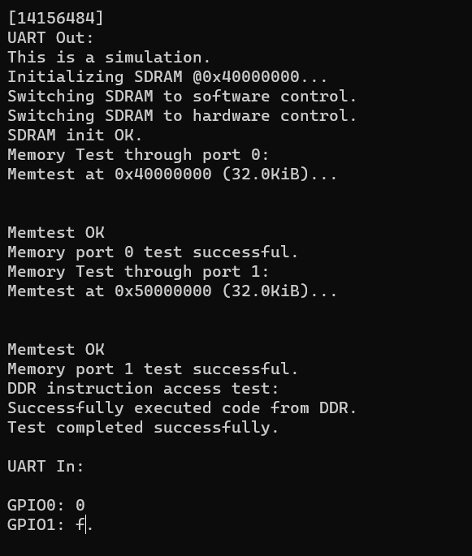

## DDR Test

### DDR Test Image on Verilator
Build the test project:
```
cd build/sim-a7-100/gw/projects/ddr_test
make ddr_test_sim_sw
```
Execute the generated verilator model in interactive mode:
```
./Vmodel -i
```
You should see something like this:



*DDR Test on Verilator.* 

### DDR Test Image on Arty A7

Build the test project:
```
cd build/arty-a7-[35|100]/gw/projects/ddr_test
make ddr_test_bit_sw
```
Connect a terminal program such as Putty or Teraterm to Arty's USB serial port. **Settings: 115200 8N1**.

Run the project:
```
make ddr_test_load
```
Verify the test program's output in the terminal. You should see something like this:


*DDR Test on Arty A7-35T.*
