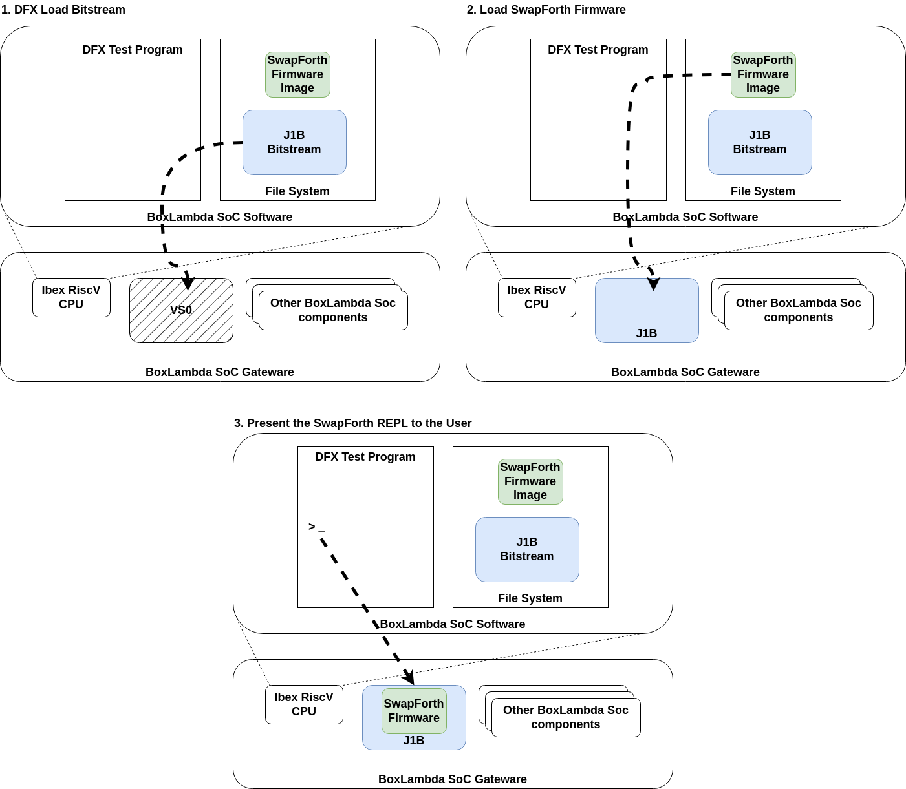
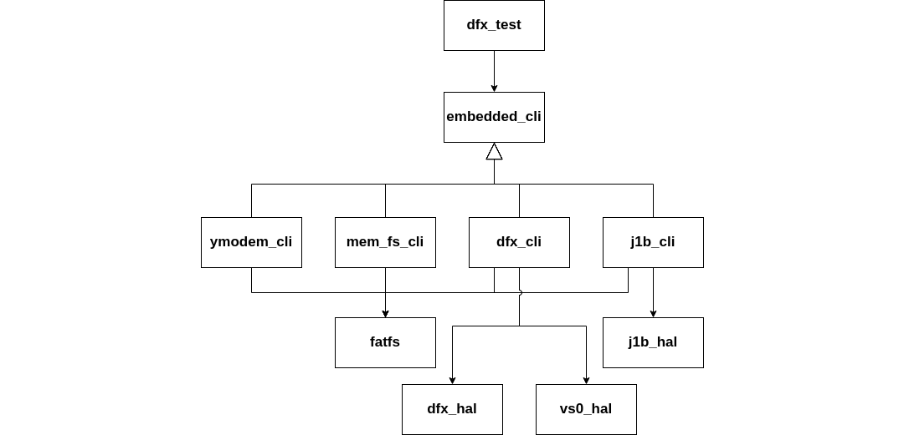

---
hide:
  - toc
---

## DFX Test

J1B is a 32-bit, minimal instruction set stack processor. It's one of the supported host CPUs of the [SwapForth](https://github.com/jamesbowman/swapforth) environment.

To demonstrate DFX support in BoxLambda, I created a test program called `dfx_test` that loads a J1B core into the SoC's *Virtual Socket 0* and then boots the SwapForth run-time firmware image on this core, presenting the user with a Forth REPL.




*The DFX Test Program.*

The DFX Test Program is not an automatic test case like the previous BoxLambda test cases. It runs exclusively on the Arty-A7-100T and requires user interaction through a CLI. The CLI commands are grouped into modules:

- [dfx_cli](https://github.com/epsilon537/boxlambda/blob/master/sw/projects/dfx_test/dfx_cli.cpp): This is a CLI wrapper around the [dfx_hal](https://github.com/epsilon537/boxlambda/blob/master/sw/components/dfx/dfx_controller_hal.h) component. Most commands let you interact with the DFX Controller at a low level. However, there's one high-level command, `dfx_load_module`, that implements the entire sequence of loading an RM's bitstream file from the filesystem into the VS0 RP.

        * dfx_control
                dfx_control <cmd> <extra byte> <extra halfword> : Write to DFX Control Register.
         * dfx_status
                Retrieve DFX status.
         * dfx_trig_get
                Read DFX Trigger registers.
         * dfx_trig_set
                dfx_trig_set <trig_id>
         * dfx_rm_info_get
                Get Reconfigurable Module Info
         * dfx_bs_info_get
                Get Bitstream Info
         * dfx_bs_info_set
                dfx_bs_info_set <idx> <hex address> <size in bytes>
         * dfx_read_core_sig
                Read core's signature register
         * dfx_load_module
                dfx_load_module <filename>

- [j1b_cli](https://github.com/epsilon537/boxlambda/blob/master/sw/projects/dfx_test/j1b_cli.cpp): This CLI allows you to boot the SwapForth firmware image on the J1B core and to transfer serial port I/O to the J1B providing access to its REPL.

         * j1b_boot
                j1b_boot <filename>: Boot J1B core with given FW image.
         * j1b_fwd_uart
                Forward UART I/O to J1B.

- [mem_fs_cli](https://github.com/epsilon537/boxlambda/blob/master/sw/components/mem_fs_cli/mem_fs_cli.cpp): This CLI module provides file system commands such as *ls* and *rm* as well as commands for loading files into memory and save memory buffers to files.

         * rm
                rm <filename> : Remove (delete) file.
         * save
                save <filename> <address> <size in bytes> : write memory contents to file.
         * load
                load <filename> [address] : read file into memory. Alloc mem. buf. if addr. not given.
         * allocBuf
                allocBuf <size> : allocate from heap buffer of given size.
         * relBuf
                relBuf <address> : release the buffer at given address.
         * ls
                list directory contents.

- [ymodem_cli](https://github.com/epsilon537/boxlambda/blob/master/sw/components/ymodem_cli/ymodem_cli.cpp): The `ymodem_rx` command allows you to transfer files from the host PC to BoxLambda's SD Card file system. I use it to transfer the RM bitstreams and J1B firmware to BoxLambda. While I could copy everything onto an SD card and then move that card from PC to BoxLambda, I prefer this method as it involves fewer moving parts.

         * ymodem_rx
                ymodem_rx <filename>: Ymodem rx and save to give file.
         * ymodem_tx_buf
                ymodem_tx_buf <filename> <hex address> <size_in_bytes>: Ymodem transmit given memory buffer with given filename



*Structure of the dfx_test software program.*

### The DFX Test on FPGA

Hook up the MicroSD PMOD as described [here](https://boxlambda.readthedocs.io/en/latest/pmods/#microsd-pmod) and insert a FAT-formatted SD card.

Connect a terminal emulator to Arty's USB serial port. I suggest using a terminal emulator that supports Ymodem transfers such as *Minicom*. **Settings: 115200 8N1**.

Build the *dfx_test_flsh* software project in the arty-a7-100 build tree:

```
cd build/arty-a7-100/sw/projects/dfx_test
make dfx_test_flsh
```

Flash the *dfx_test_flsh* program onto the target:

```
make dfx_test_flsh_flash_sw
```

Build the *boxlambda_dfx* gateware project in the *arty-a7-100* build tree:

```
cd build/arty-a7-100/gw/projects/boxlambda_dfx
make boxlambda_dfx_bit
```

Flash the gateware build onto the target:

```
make boxlambda_dfx_flash_gw
```

When flashing has been completed, the target should boot up. You should see the following messages:

```
Starting...
Initializing SDRAM @0x20000000...
Switching SDRAM to software control.
Read leveling:
  m0, b00: |00000000000000000000000000000000| delays: -
  m0, b01: |11111111111111111111111111111100| delays: 14+-14
  m0, b02: |00000000000000000000000000000000| delays: -
  m0, b03: |00000000000000000000000000000000| delays: -
  m0, b04: |00000000000000000000000000000000| delays: -
  m0, b05: |00000000000000000000000000000000| delays: -
  m0, b06: |00000000000000000000000000000000| delays: -
  m0, b07: |00000000000000000000000000000000| delays: -
  best: m0, b01 delays: 14+-14
  m1, b00: |00000000000000000000000000000000| delays: -
  m1, b01: |11111111111111111111111111111100| delays: 14+-14
  m1, b02: |00000000000000000000000000000000| delays: -
  m1, b03: |00000000000000000000000000000000| delays: -
  m1, b04: |00000000000000000000000000000000| delays: -
  m1, b05: |00000000000000000000000000000000| delays: -
  m1, b06: |00000000000000000000000000000000| delays: -
  m1, b07: |00000000000000000000000000000000| delays: -
  best: m1, b01 delays: 14+-14
Switching SDRAM to hardware control.
SDRAM init OK.
Mounting filesystem...
CID: 534d5402:47323341:7d604971:3168018d
Reading VS0 core signature register...
Read signature value: 0x510b
Starting CLI...
```

Build the *vs0_j1b* RM component in the *arty-a7-100* build tree:

```
cd build/arty-a7-100/gw/components/vs0_j1b
make vs0_j1b_bit
```

Build the *vs0_stub* RM component in the *arty-a7-100* build tree:

```
cd build/arty-a7-100/gw/components/vs0_stub
make vs0_stub_bit
```

Transfer the following files to an SD Card and rename them to something short:

- `build/arty-a7-100/gw/components/vs0_j1b/vs0_j1b_pblock_vs0_partial.bin.bin_for_icap`: This is the *vs0_j1b* RM Partial Bitstream file. Let's rename it to *vs0_j1b*.
- `build/arty-a7-100/gw/components/vs0_stub/vs0_stub_pblock_vs0_partial.bin.bin_for_icap`: This is the *vs0_stub* RM Partial Bitstream file. Let's rename it to *vs0_stub*.
- `sw/projects/dfx_test/nuc.bin`: This is the SwapForth firmware image for the J1B processor.

Insert the SD Card in BoxLambda's MicroSD card slot.

---
Alternatively, instead of copying the files to an SD Card mounted on your PC and then moving the SD Card to BoxLambda, you can leave a card inserted into BoxLambda's SD Card slot and transfer the files using the Ymodem protocol. To do that, enter the following command on the CLI:

```
ymodem_rx <filename>
```

Then send the file in question using your terminal emulator's ymodem function. The transferred file will be saved on the SD card as *\<filename\>*.

---

Confirm that all the required files are on the filesystem by running the *ls* CLI command:

```
> ls
   <DIR>   SYSTEM~1
     32768 NUC.BIN
    592780 VS0_J1B
    592780 VS0_STUB
1 dirs, 3 files.
```

At this point, the RM equipped in the VS0 RP is *vs0_stub*. Let's switch over to the *vs0_j1b* RM. Enter the following command on the CLI:

```
> dfx_load_module vs0_j1b
Loading file vs0_j1b, size: 592780 bytes, into memory at address 0x20008370.
Installing RM...
Done.
```

Now we can boot the J1B firmware:

```
> j1b_boot nuc.bin
Reading core signature register...
Read signature value: 0xf041011b
Signature correct.
Loading file nuc.bin, size: 32768 bytes, into memory at address 0x20000368.
Booting J1B...
Taking J1B out of reset...
Done.
```

Finally, we forward the serial port to the J1B core so we can access its REPL:

```
> j1b_fwd_uart
Reading core signature register...
Read signature value: 0xf041011b
Signature correct. Checking if J1B has been booted up...
Forwarding UART. Press <ESC> to return.
```

You can now start entering Forth instructions.

```
CR 42 emit CR
*
 ok
```

Optionally, exit out of the REPL and switch back to the *vs0_stub* RM:

```
Returning to shell...
> dfx_load_module vs0_stub
Loading file tst_stub, size: 592780 bytes, into memory at address 0x20008370.
Issuing DFX trigger...
DFX loading...
DFX state: 4
DFX state: 7
Done.
>
```

