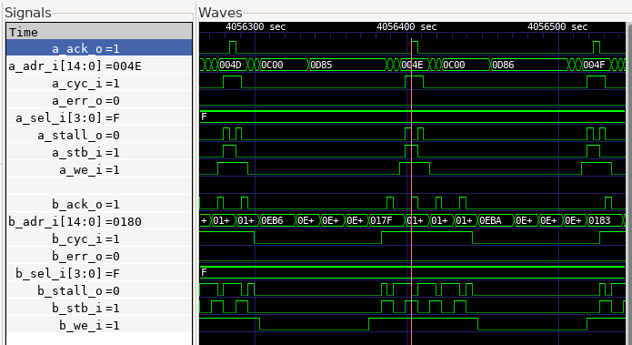

## Dual Port RAM Test

The Dual Port RAM Test verifies access to the dual port memories. The test program checks instruction and data access to both of the memories. The program also includes a test exercising both ports of the Dual Port RAM simultaneously. One port is accessed by the CPU, and the other port by the DMA Controller.



*Both DPRAM ports being accessed simultaneously.*

### Dual Port RAM Test on Verilator

Build the **dual_port_ram_test** project:

```
cd build/sim-a7-100/gw/projects/dual_port_ram_test
make dual_port_ram_test_sim_sw
```

Execute the generated Verilator model. You should see the following output:

```
./Vmodel
...
Executing code from DMEM...
CMEM word copy...
DMEM word copy...
Hello CMEM!
Load PicoRV Program wordcopy_burst
Taking PicoRV out of reset...
Dual copy from DMEM to CMEM...
Dual copy from CMEM to DMEM...
Test Successful.
```

### Dual Port RAM Test on Arty A7

Connect a terminal emulator such as Putty or Minicom to Arty's USB serial port. **Settings: 115200 8N1**.

Build the project in an Arty A7 build tree:

```
cd build/arty-a7-100/gw/projects/dual_port_ram_test
make dual_port_ram_test_bit_sw
```

Download the generated bitstream file to the Arty A7:

```
make dual_port_ram_test_load
```

In the Putty terminal, you should see the same output as with the Verilator test build above.
