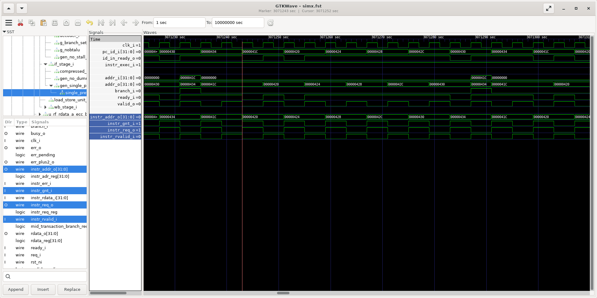

## Ibex Performance Test

The value of this test is mostly in the waveform it generates. Checking the waveform of this test allows you to see instruction fetch latency and the cycle count of various common instructions: load-word and store-word to internal memory and VRAM, reading SoC registers, addi, branch taken, branch not taken.

The test program consist of the following sub-tests:

- **do_nothing()**: Measures how many cycles it take to call *mcycle_start()* and *mcycle_stop()*.
- **lw_register_loop()**: Repeatedly reads a SoC register and measures how long it takes.
- **lw_sw_copy_loop()**: Copies 100 words from DMEM to DMEM, or from VRAM to VRAM, using a naive loop and measures how long it takes.
- **lw_sw_copy_loop_unrolled()**: Same as the previous test, but with the loop unrolled.

### Ibex Performance Test on Verilator

Build the **ibex_perf_test** project:

```
cd build/sim-a7-100/gw/projects/ibex_perf_test
make ibex_perf_test_bit_sw
```

Execute the generated Verilator model with tracing enabled (*-t). You should see the following output:

```
./Vmodel -t
SIM: Tracing enabled
DUT: Do nothing: 8 cycles.
DUT: Expected: 8 cycles.
DUT: lw_sw_register_loop: addr: 0x10000208, 12 cycles/iteration.
DUT: Expected: 12 cycles.
DUT: lw_sw_copy_loop: dest: 0x24b68, src: 0x20b68, 14 cycles/iteration.
DUT: Expected: 14 cycles.
DUT: lw_sw_copy unrolled: 8 cycles/iteration.
DUT: Expected: 8 cycles.
DUT: lw_sw_copy_loop: dest: 0x12040190, src: 0x12044190, 24 cycles/iteration.
DUT: Expected: TBD.
DUT: Test Successful.
SIM: Test passed.
```

Open the generated waveform file with GTKWave:

```
gtkwave simx.fst
```

Some interesting signals to monitor are:

```
TOP.sim_main.dut.boxlambda_soc_inst.wb_ibex_core.u_top.u_ibex_core.id_stage_i.controller_i.clk_i
TOP.sim_main.dut.boxlambda_soc_inst.wb_ibex_core.u_top.u_ibex_core.id_stage_i.controller_i.pc_id_i[31:0]
TOP.sim_main.dut.boxlambda_soc_inst.wb_ibex_core.u_top.u_ibex_core.id_stage_i.controller_i.id_in_ready_o
TOP.sim_main.dut.boxlambda_soc_inst.wb_ibex_core.u_top.u_ibex_core.id_stage_i.controller_i.instr_exec_i
TOP.sim_main.dut.boxlambda_soc_inst.wb_ibex_core.u_top.u_ibex_core.if_stage_i.gen_single_prefetch_buffer.single_prefetch_buffer_i.addr_i[31:0]
TOP.sim_main.dut.boxlambda_soc_inst.wb_ibex_core.u_top.u_ibex_core.if_stage_i.gen_single_prefetch_buffer.single_prefetch_buffer_i.addr_o[31:0]
TOP.sim_main.dut.boxlambda_soc_inst.wb_ibex_core.u_top.u_ibex_core.if_stage_i.gen_single_prefetch_buffer.single_prefetch_buffer_i.branch_i
TOP.sim_main.dut.boxlambda_soc_inst.wb_ibex_core.u_top.u_ibex_core.if_stage_i.gen_single_prefetch_buffer.single_prefetch_buffer_i.ready_i
TOP.sim_main.dut.boxlambda_soc_inst.wb_ibex_core.u_top.u_ibex_core.if_stage_i.gen_single_prefetch_buffer.single_prefetch_buffer_i.valid_o
TOP.sim_main.dut.boxlambda_soc_inst.wb_ibex_core.u_top.u_ibex_core.if_stage_i.gen_single_prefetch_buffer.single_prefetch_buffer_i.instr_addr_o[31:0]
TOP.sim_main.dut.boxlambda_soc_inst.wb_ibex_core.u_top.u_ibex_core.if_stage_i.gen_single_prefetch_buffer.single_prefetch_buffer_i.instr_gnt_i
TOP.sim_main.dut.boxlambda_soc_inst.wb_ibex_core.u_top.u_ibex_core.if_stage_i.gen_single_prefetch_buffer.single_prefetch_buffer_i.instr_req_o
TOP.sim_main.dut.boxlambda_soc_inst.wb_ibex_core.u_top.u_ibex_core.if_stage_i.gen_single_prefetch_buffer.single_prefetch_buffer_i.instr_rvalid_i
```

{ .mdx-lightbox }
*Ibex Performance Test Waveform.*

To navigate the waveform, check the ID stage's *pc_id_i* values against the addresses in the disassembly of the ibex_perf_test_ram executable.

### Ibex Performance Test on Arty A7

Connect a terminal emulator such as Putty or Minicom to Arty's USB serial port. **Settings: 115200 8N1**.

Build the project in an Arty A7 build tree:

```
cd build/arty-a7-100/gw/projects/ibex_perf_test
make ibex_perf_test_bit_sw
```

Download the generated bitstream file to the Arty A7:

```
make ibex_perf_test_load
```

In the terminal emulator, you should see the same output as in the Verilator test build above.
