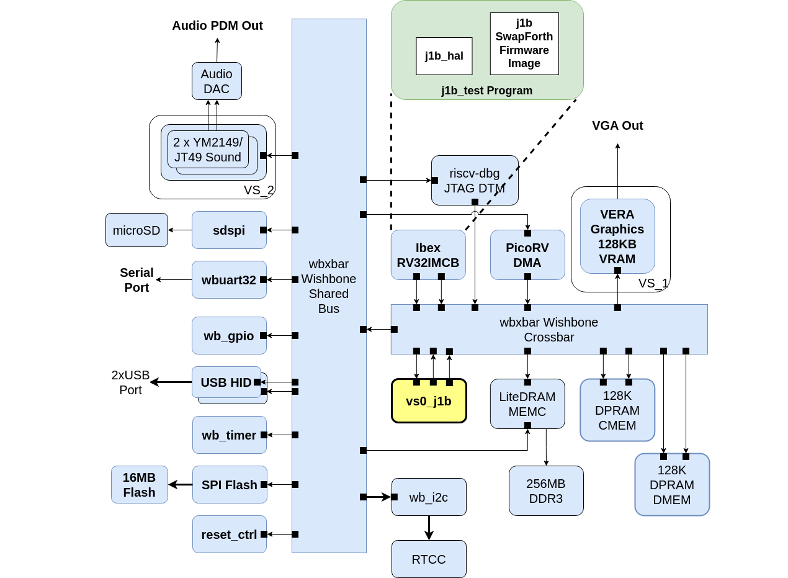

---
hide:
  - toc
---

## J1B Test

**The j1b_test Test SoC project directory**:

[https://github.com/epsilon537/boxlambda/tree/master/gw/projects/j1b_test](https://github.com/epsilon537/boxlambda/tree/master/gw/projects/j1b_test)

**The j1b_test Test Program**:

[https://github.com/epsilon537/boxlambda/blob/master/sw/projects/j1b_test/j1b_test.cpp](https://github.com/epsilon537/boxlambda/blob/master/sw/projects/j1b_test/j1b_test.cpp)

**J1b_test** is a Test SoC looking like this:



*The j1b_test Test SoC.*

On the Ibex software side, I defined a J1B Hardware Access Layer (*j1b_hal*) giving access to the core's register interface and including a function for loading the firmware into the core. The j1b_test program uses the j1b_hal to perform the following:

1. Boot the SwapForth firmware.
2. Forward the BoxLambda serial port input data to the J1B core UART input register.
3. Forward J1B core UART output data to the BoxLambda serial port.

This way, the SwapForth REPL running on the J1B core is presented to the user on the serial port terminal.

### The J1B Test on Verilator

Build the `j1b_test` project in the *sim-a7-100* build tree:

```
cd build/sim-a7-100/gw/projects/j1b_test
make j1b_test_sim
```

Execute the generated Verilator model. You should see the following output:

```
./Vmodel
DUT: Starting...
DUT: Reading J1B core signature register...
DUT: Signature correct.
DUT: J1B program length in bytes: 32768
DUT: Taking J1B out of reset...
DUT: Sending test string: 42 EMIT
DUT:
DUT: Test string sent. Forwarding UART...
DUT:  * ok
SIM: String matched.
SIM: Test passed.
```

The test string *42 emit* is a Forth instruction, requesting to *emit* (print) the character with ASCII code 42 (an asterisk). *\* ok* is the response from the J1B processor.

### The J1B Test on FPGA

Connect a terminal emulator such as Putty or Minicom to Arty's USB serial port. **Settings: 115200 8N1**.

Build the project in *arty-a7-100t* build tree:

```
cd build/arty-a7-100/gw/projects/j1b_test
make j1b_test_bit
```

Download the generated bitstream file to the Arty A7:

```
make j1b_test_load
```

You should see the same output as in the Verilator test above.
The REPL is still listening. You can continue entering Forth instructions:

```
: star 42 emit ;  ok
cr star cr star cr star
*
*
* ok
```

