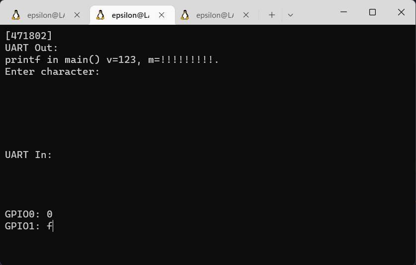
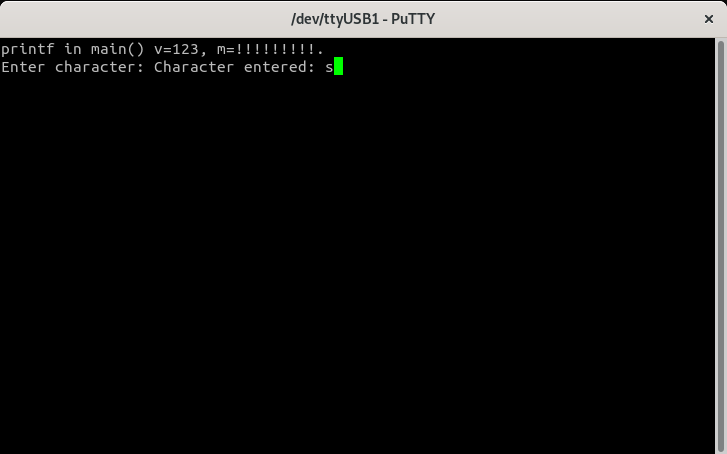

## PicoLibc Test

### PicoLibc Test Image on Verilator

Build the test project:
```
cd build/sim/gw/projects/picolibc_test
make picolibc_test_sim
```
Execute the generated verilator model in interactive mode:
```
./Vmodel -i
```
You should see something like this:



### PicoLibc_test Image on Arty A7
Build the test project:
```
cd build/arty-a7-[35|100]/gw/projects/picolibc_test
make picolibc_test_impl
```
Connect a terminal program such as Putty or Teraterm to Arty's USB serial port. **Settings: 115200 8N1**.
Run the project:
```
make picolibc_test_load
```
Verify the test program's output in the terminal. Enter a character to verify that stdin (standard input) is also working.


