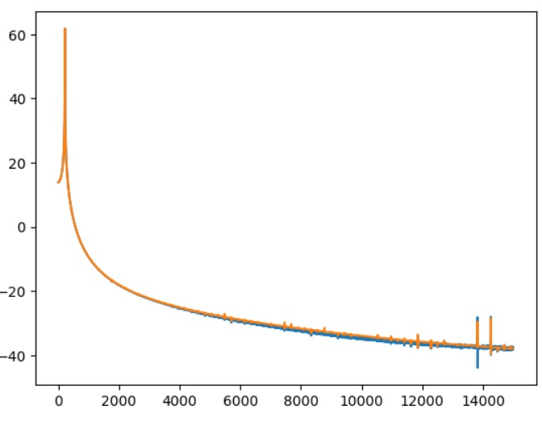
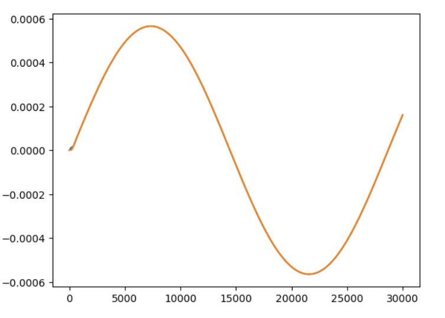
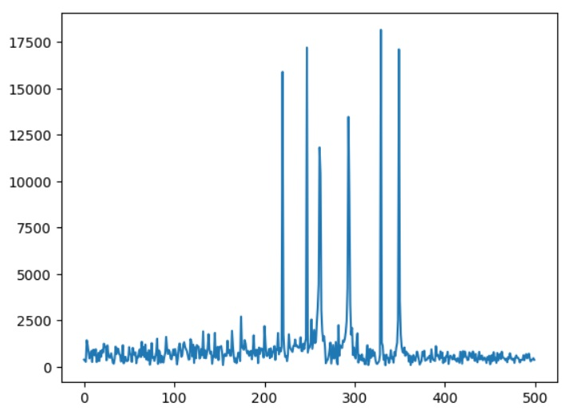

## YM2149 PSG, Audio DAC, and ST-Sound Test

### Audio DAC Test on Verilator

Build the *audio_dac_test* project:
```
cd build/sim-a7-100/gw/projects/audio_dac_test
make audio_dac_test_sim
```
Execute the generated Verilator model:
```
./Vmodel
DAC Output File: dac_out.py
PCM Output File: pcm_out.py
```
The Verilator model should have generated Python files *dac_out.py* and *pcm_out.py*:
```
ls *.py
dac_out.py  pcm_out.py
```
Execute the Audio DAC Test Python script. Pass in the *-p* option to see the plots. You should see a frequency domain plot, a time domain plot, and the correlation match between the PCM and the DAC signals:
```
PYTHONPATH="." ../../../../../gw/projects/audio_dac_test/test/dac_test.py -p
Time Domain Correlation: 1.000000
Frequency Domain Correlation: 1.000000
```


*Audio DAC Test Frequency Magnitude Plot.*



*Audio DAC Test Time Domain Plot.*

The plots show both the filtered PCM and DAC output signals, but because they overlap almost perfectly, you only see one waveform.

### Audio DAC Test on Arty A7

If you're running on WSL, check BoxLambda's documentation [On WSL](https://boxlambda.readthedocs.io/en/latest/installation/#on-wsl) section.

Hook up the Audio PMOD as described [here](pmods.md#audio-pmod).

Build the *audio_dac_test* project in an Arty A7 build tree (*arty-a7-35* or *arty-a7-100*):
```
cd build/arty-a7-100/gw/projects/audio_dac_test
make audio_dac_test_bit
```
Download the generated bitstream file to the Arty A7:
```
make audio_dac_test_load
```
You should hear a 440Hz tone. You can check the pitch with a pitch detector app.
   
### YM2149 DAC Test on Verilator

Build the *ym2149_dac_test* project:
```
cd build/sim-a7-100/gw/projects/ym2149_dac_test
make ym2149_dac_test_sim_sw
```
Execute the generated Verilator model. You should see the following output:
```
./Vmodel
DAC Output File: dac_out.py
PCM Output File: pcm_out.py
...
YM2149 test.
YM2149 config complete.                 
No overflows detected.
```  
The Verilator model should have generated Python files *dac_out.py* and *pcm_out.py*:
```
ls *.py
dac_out.py  pcm_out.py
```
Execute the YM2149 DAC Test Python script. Pass in the *-p* flag to see the plot. The plot should show a frequency spectrum plot with six pitches. The script's terminal output should look like this:
```
PYTHONPATH="." ../../../../../gw/projects/ym2149_dac_test/test/ym2149_test.py -p
Detected pitches:
[440. 494. 522. 586. 658. 698.]
Expected pitches:
[440.0, 493.88, 523.55, 587.33, 659.25, 698.46]
Relative Deviations:
[ 0.          0.00024297 -0.00296056 -0.00226449 -0.00189609 -0.00065859]
```



*Dual YM2149 6-channel Pitch Test Frequency Spectrum Plot.*

### YM2149 DAC Test on Arty A7

If you're running on WSL, check BoxLambda's documentation [On WSL](https://boxlambda.readthedocs.io/en/latest/installation/#on-wsl) section.

Hook up the Audio PMOD as described [here](pmods.md#audio-pmod).

Connect a terminal program such as Putty or Teraterm to Arty's USB serial port. **Settings: 115200 8N1**.

Build the *ym2149_dac_test* project in an Arty A7 build tree (*arty-a7-35* or *arty-a7-100*):
```
cd build/arty-a7-100/gw/projects/ym2149_dac_test
make ym2149_dac_test_bit_sw
```
Download the generated bitstream file to the Arty A7:
```
make ym2149_dac_test_load
```
You should hear a 6-tone chord.
   
### ST-Sound Test on Verilator

Build the *stsound_test* project:
```
cd build/sim-a7-100/gw/projects/stsound_test
make stsound_test_sim_sw
```
Execute the generated Verilator model. Pass in the SD card image that's checked in as part of the test. The SD card image contains the song that we want to play. The model runs for 5s simulated time. It will take a few minutes in real-time to complete. You should see the following output:
```
./Vmodel -s ../../../../../gw/projects/stsound_test/test/sdcard.img
SD Image File: ../../../../../gw/projects/stsound_test/test/sdcard.img
SDCARD: NBLOCKS = 131072
PCM Output File: pcm_out.py
...
SDSPI: CMDIDX = 6 -- WE HAVE A COMMAND # 0! [ 40 00 00 00 00 95 ]
SDSPI: Received a command 0x40 (0) arg 0x0
SDSPI: CMDIDX = 6 -- WE HAVE A COMMAND # 8! [ 48 00 00 01 a5 69 ]
SDSPI: Received a command 0x48 (8) arg 0x1a5
Mounting...
SDSPI: CMDIDX = 6 -- WE HAVE A COMMAND #55! [ 77 00 00 00 00 65 ]
SDSPI: Received a command 0x77 (55) arg 0x0
...
SDSPI: Received a command 0x51 (17) arg 0x0
Reading from block 00000000 of 00020000
READ: Seek to sector 0
CID: 4c4f539c:47343658:03802910:c938017b
SDSPI: CMDIDX = 6 -- WE HAVE A COMMAND #17! [ 51 00 00 01 04 0b ]
SDSPI: Received a command 0x51 (17) arg 0x104
Reading from block 00000104 of 00020000
READ: Seek to sector 260
Listing directory contents...
/ANCOOL1.YM
Switching to PSG_1
SDSPI: CMDIDX = 6 -- WE HAVE A COMMAND #17! [ 51 00 00 01 30 15 ]
...
READ: Seek to sector 307
Starting playback...
No overflows detected.
Test passed.  
```
The Verilator model should have generated Python file *pcm_out.py*:
```
ls *.py
pcm_out.py
```
Execute the ST-Sound Test Python script. Pass in the reference WAV file to check against. The reference WAV file is checked in as part of the test. You should hear the first few seconds of the song play. The script's terminal output should look like this:
```
PYTHONPATH="." ../../../../../gw/projects/stsound_test/test/stsound_test.py -r ../../../../../gw/projects/stsound_test/test/ref.wav
Calculating fingerprint by fpcalc for test.wav
Calculating fingerprint by fpcalc for ../../../../../gw/projects/stsound_test/test/ref.wav
File A: test.wav
File B: ../../../../../gw/projects/stsound_test/test/ref.wav
Match with correlation of 100.00% at offset 0
```
(You may have to scroll the box horizontally to see the complete command line.)

### ST-Sound Test on Arty A7

If you're running on WSL, check BoxLambda's documentation [On WSL](https://boxlambda.readthedocs.io/en/latest/installation/#on-wsl) section.

Hook up the Audio PMOD as described [here](pmods.md#audio-pmod).

Hook up the MicroSD PMOD as described [here](pmods.md#microsd-pmod).

Locate YM file **ANCOOL1.YM** in directory **boxlambda/sub/StSound/YmSampleFiles/**. Copy it to a FAT-formatted SD card and insert the SD card into the card reader.  

Connect a terminal program such as Putty or Teraterm to Arty's USB serial port. **Settings: 115200 8N1**. 

Build the *stsound_test* project in an Arty A7 build tree. **This test requires an Arty A7-100T.** The software footprint of this test doesn't fit in the internal memory of the Arty A7-35T build.
```
cd build/arty-a7-100/gw/projects/stsound_test
make stsound_test_bit_sw
```
Download the generated bitstream file to the Arty A7:
```
make stsound_test_load
```
You should hear the chiptune play. In the terminal window you should see the following:
```
Mounting...
CID: 534d5402:47323341:7d604971:3168018d
Listing directory contents...
...
/ANCOOL1.YM
Switching to PSG_1
Loading YM file: ancool1.ym ...
Starting playback... 
``` 
There are a few controls you can play around with:

- Set SW0 (leaving SW1 and SW2 off), then press buttons 0/1 to increase/decrease the volume.
- Set SW1 (leaving SW0 and SW2 off), then press buttons 0/1 to increase/decrease the bass level.
- Set SW2 (leaving SW0 and SW1 off), then press buttons 0/1 to increase/decrease the treble level.
- SW3, sampled once at SW boot time, selects PSG0 or PSG1 to play the chiptune.
